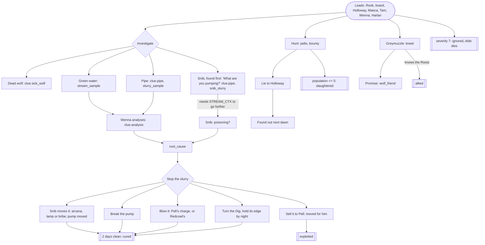
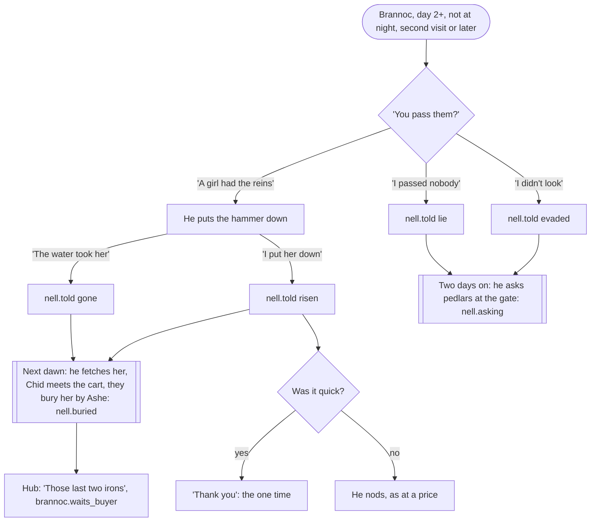

# Writing pass: Act 1, design and implementation spec

This is the single source of truth for the Act 1 writing pass: what the story
now is, every route and gate in it, every fact and journal line by exact
name, every case where something can be found before its quest is given, and
what is left to build in code. The whole arc it points at is
`STORY_BIBLE.md`; how people talk is `VOICES.md`.

**Status marks.** Every item carries one:

- **[DATA, done]**: written into `godot/data/content/` (or a text-only line in
  a zone script) and played by a named test. Nothing to build.
- **[CODE, to do]**: needs the implementer. Section 11 has each one: what,
  where, the exact data, and the test scenarios that prove it.
- **[LATER]**: an Act 2 or 3 beat. Act 1 already records the fact it needs;
  the beat itself is in `STORY_BIBLE.md` sections 7 and 8.

Tests: `cd godot/tests && dotnet test` (238 pass). The pass's own scenarios
are `godot/tests/BreadcrumbTests.cs`; four older tests in `QuestTests.cs`
were given the context the new gates require (section 13).

---

## 1. The arc in one page

The full arc is `STORY_BIBLE.md`. In short:

- **Spine.** Under Thornhollow the Morrow, vast and alive, is chained by the
  Seventh Legion: seven links, each anchored in a heart kept by a Warden.
  Ember is its light and its pain. The chain is failing (the Ashford Fall, ten
  years ago). Vonnra, the last binder, needs an **Unchained** (one of the rare
  dead who rise with their mind) to walk through the Legion's dead and become
  a new link. She relit the Low Ford's lamps with Brannoc's irons and sent
  travellers across at night until one rose: the survivor. The survivor's first
  act, killing the Ford-Warden, loosed a heart; Grimtunnel took it down.
- **Act 1, The Waystation** (now): two troubles (the wolves, the caravan),
  three mysteries (the sealed door, the thing below, the lamps). Ends with
  Vonnra's fortune.
- **Act 2, The North Road**: the Dig breaks through under the Penhale farm;
  Keegan's chapter four; Holloway's letter and the boots; Harlan exposed; Pell's
  numbers; the Kerchiefs as the army; Brannoc's last two irons and a second
  crossing woken (a second Unchained); the Vigil's silver cages at Silverstair
  and Ysolde's brother in one; the turn: **you are Unchained**; the Vigil's war
  at the north gate.
- **Act 3, The Morrow**: Vonnra's truth; Jessop on the stair; the Warden's
  heart in Grimtunnel's hands; Chid's truth (he is Unchained too); the
  Legion's coin that buys one return; the Morrow prays to die. Endings:
  **re-forge** (someone Unchained lies down in the chain: the survivor, Chid,
  Vonnra, the second Unchained, or a caged stranger), **break** (no more ember
  anywhere; the Unchained die at dawn, but for the coin's holder), **take the
  light** (a new god).

Act 1 asks none of the big questions out loud. It plants all of them, and
records the choices whose weight lands later (section 9).

## 2. What changed, at a glance

| Thread | What is new | Status |
|---|---|---|
| Found early | Pell's ledger, the strongbox, the Roost, the cages and the Dig, each found before its quest, now start their story rather than finish it; people react to a survivor who arrives already knowing | [DATA, done] (dialogue gates and reactions); [CODE, done] C1, C2 (the strongbox's journal line, ledger objectives) |
| The Beast Problem | Snib explains his pump to a stranger, and will not move it for someone with no reason to care; Redcowl's charge as a way to blow the pump; Pell sells the charge only to someone who knows the Dig | [DATA, done]; [CODE, to do] C6 |
| The Missing Caravan | Jessop named and missing; Harlan's greeting follows the days and the news; telling Harlan where the Roost is; the ledger read for its date; the six crates' fate; Jory told or lied to; who tells Redcowl where Pell sleeps; Harlan pays for the boy even after you sold his box | [DATA, done]; [CODE, done] C5 (the crates in an empty camp) |
| The Lamps at the Low Ford | A new mystery: the dead watchman's book, Corran and Dannet, Keegan, Brannoc's irons and his mark, Rook's money, the carters' notice, the square coin, Nell; the accusation at the fortune | [DATA, done]; [CODE, done] C3 (the prologue writes the first line) |
| Nell | Brannoc asks after his daughter; the truth buries her, a lie sends him to the gate | [DATA, done] |
| Seeds | Holloway's letter; Sella's pillow talk (quoted in the fortune); the Wayfinder's margin; Keegan after a death; Chid's "C"; Tam's knocking; Maeca and the Kerchiefs; Redcowl's "little bird" and "Ashford"; Rav names his brother | [DATA, done] |
| The fortune | Seven readings now (beasts, caravan, crates, Pell, self, before the ford, below), the accusation, the name | [DATA, done] |
| The chapter's end page | The lamps as an open thread; the new beats | [CODE, done] C4 |
| Fixes | The shrine-bell contradiction; retired words; Holloway's "my own toll clerk"; Rav's "eleven years"; a rule written twice; item lore that assumed you knew; morning reports in the wrong tense | [DATA, done] |

## 3. Shared gates

These conditions are used in several places. They are already in the data;
the code items in section 11 use them too. JSON as in `dialogue.json`.

| Name | Meaning | JSON |
|---|---|---|
| `CTX_KERCHIEF` | The survivor can know "R." is someone in red: Kerchief work seen or told of | `{"any":[{"quest":{"id":"caravan","entry":"wreck"}},{"quest":{"id":"caravan","entry":"ruts"}},{"quest":{"id":"caravan","entry":"roost_found"}},{"quest":{"id":"caravan","entry":"redcowl_met"}},{"quest":{"id":"caravan","entry":"redcowl_wagons"}},{"quest":{"id":"caravan","entry":"roost_raided"}},{"knows":"hint.roost"}]}` |
| `CTX_COYLE` | The survivor knows which night the ledger is about: the Coyle wagons | `{"any":[{"quest":{"id":"caravan","entry":"harlan_plea"}},{"quest":{"id":"caravan","entry":"guard_says"}},{"quest":{"id":"caravan","entry":"clerk_turned"}},{"quest":{"id":"caravan","entry":"wreck"}},{"quest":{"id":"caravan","entry":"redcowl_wagons"}},{"quest":{"id":"caravan","entry":"ledger_read"}}]}` |
| `LEDGER_CTX` | Both: the ledger proves something | `{"all":[CTX_KERCHIEF, CTX_COYLE]}` |
| `STREAM_CTX` | The survivor has a reason to think the water is the trouble | `{"any":[{"knows":"clue.green_stream"},{"knows":"clue.sick_wolf"},{"knows":"clue.analysis"},{"knows":"root_cause"},{"knows":"hint.stream"}]}` |
| `LAMPS_CTX` | Enough of the lamps to say it to Vonnra: whose irons, and whose coin or money | `{"all":[{"any":[{"quest":{"id":"lamps","entry":"irons"}},{"quest":{"id":"lamps","entry":"mark"}}]},{"any":[{"quest":{"id":"lamps","entry":"coin"}},{"quest":{"id":"lamps","entry":"rook"}},{"quest":{"id":"lamps","entry":"notice"}}]}]}` |
| `CRATES_FREE` | The six crates' fate is still open | `{"all":[{"not":{"fact":"be.crates","exists":true}},{"not":{"history":"burned_roost"}}]}` |
| `NELL_TRUTH` | Brannoc was told how Nell died | `{"any":[{"fact":"nell.told","eq":"gone"},{"fact":"nell.told","eq":"risen"}]}` |
| `PUMPING` | The Dig's pump still runs | `{"any":[{"not":{"fact":"dig.pump","exists":true}},{"fact":"dig.pump","eq":"running"}]}` |
| `COYLE_NAMED` | The survivor has heard the name Coyle | `CTX_COYLE` plus `{"quest":{"id":"caravan","entry":"roost_told"}}` |
| `JESSOP_KNOWN` | The survivor has heard of Jessop | `{"any":[{"quest":{"id":"caravan","entry":"clerk_turned"}},{"quest":{"id":"caravan","entry":"sella_clerk"}},{"quest":{"id":"caravan","entry":"ledger_read"}}]}` |

**The found-early principle.** A thing found before its quest gives a journal
line that stands on its own (it never assumes the quest), activates the quest,
and points at the person to take it to. That person reacts to a survivor who
arrives already knowing. A turn-in that proves something (exposing Pell,
moving the pump, accusing Vonnra) is hidden, not greyed, until the survivor
holds what it proves, because the choice's own words would give the answer
away. Instead an earlier choice is offered that turns the find into the next
breadcrumb.

---

## 4. The Beast Problem (`beasts`)

### 4.1 Graph

### 4.2 Breadcrumbs

| Trigger | Where, when | Adds | Status |
|---|---|---|---|
| "What's the talk?" | Rook, any time | `beasts/rumour`, `caravan/harlan_plea` | existing |
| Reading the board | Notice board | `beasts/holloway_bounty` (if unsettled) | existing |
| Meeting Holloway, Maeca, Wenna, Tam, Harlan | the square | `holloway_bounty`, `maeca_theory`, `wenna_request`, `tam_plea`, `harlan_view` | existing |
| "What are you pumping?" | Snib, at the Dig, while `STREAM_CTX` fails | `learn clue.pipe`; `beasts/snib_slurry`, quest active | [DATA, done] |
| Redcowl's charge | Redcowl, after `crates_keep`, while `PUMPING` | `give blasting_ember`; `redcowl.gave_charge`; `beasts/redcowl_charge` | [DATA, done] |
| Pell's blasting ember on his shelf | Pell's shop, once `root_cause` or `clue.blasting_ember` | the item | [DATA, done]; restock timing is C6 |

### 4.3 Order constraints

- Snib's offers to move, bribe, lamp-trick or fight over the pump need
  `STREAM_CTX`: nobody asks a foreman to move his outflow without a reason to
  care about the water. Without it Snib explains himself instead. [DATA, done]
- Pell sells the charge only to someone who knows the Dig (`root_cause`) or
  what "B.E." means (`clue.blasting_ember`). [DATA, done]
- Greymuzzle's "run with me" needs the Roost (`hint.roost` or `roost_found`).
  (existing)
- The bounty stops once Holloway is shown the cause after admitting the wolves
  are sick (`bounty.stopped`). (existing)

### 4.4 Found early

| Find | Before | Handled | Status |
|---|---|---|---|
| The Dig and Snib | any clue | Snib explains the pump (`snib.what`); the journal gains `snib_slurry`; the tracker then says fill a bottle and take it to Wenna (it already reads `clue.pipe`) | [DATA, done] |
| The pipe | Wenna | `clue.pipe`, `slurry_sample`; Wenna's analysis has a variant for the slurry | existing |
| The dead wolf | anyone | `clue.sick_wolf`; Holloway's "sick, not bold" opens | existing |
| Greymuzzle | the quest | `greymuzzle_met` activates it | existing |
| Pell's charge | knowing the Dig | gated | [DATA, done] |

### 4.5 Facts

| Fact | Values | Written by | Read by |
|---|---|---|---|
| `beasts.outcome` | `cured`, `allied`, `slaughtered`, `exploited`, `ignored` | rules `stream.clear`, `stream.clear_sold`, `wolves.gone`, `beasts.gate`; `greymuzzle.ally` | everywhere |
| `dig.pump` | `running`, `moved`, `broken`, `blown` | Snib, Pell (later), `Verge.cs` | rules, Verge, Act 2 beat 1 |
| `redcowl.gave_charge` | true | `redcowl.crates_charge` | Act 2 |
| `bounty.stopped`, `beasts.told_holloway`, `holloway.lied_to`, `wolf.blood`, `promise.pack`, `promise.broken`, `tam.pa_in`, `tam.farm`, `stream.clear`, `dig.sold`, `dig.pell_cut` | as before | as before | as before |

### 4.6 Journal (`quests.json` `beasts`)

All entries, exact text, in order. New: **`snib_slurry`**, **`redcowl_charge`**.

| Entry | Text |
|---|---|
| `rumour` | Wolves are attacking travellers on the Old Road. Everyone in the Waystation has an opinion about why. |
| `holloway_bounty` | Captain Holloway pays five gold a pelt, and fifty for the fang of Greymuzzle, the old alpha. "They're bolder," he says. |
| `maeca_theory` | Maeca Barefoot says the wolves are not hunting but running: something is driving them out of the deep wood. |
| `wenna_request` | Old Wenna says the animals were never like this. She wants a sample of the Thornhollow stream to test. |
| `tam_plea` | Tam saw wolves drink from the stream and fall down. "Something's killing them," he says. Nobody believes a child. |
| `harlan_view` | Harlan Coyle blames the wolves for his missing caravan. He wants them dead, all of them. |
| `clue.sick_wolf` | A dead wolf in the Verge with no wound on it: black gums, milky eyes, ribs like a washboard. |
| `clue.green_stream` | The Thornhollow stream runs green below the blight. Nothing grows at its edge. |
| `clue.pipe` | Upstream, a pipe of riveted iron spills warm, faintly glowing slurry into the water. |
| `clue.lampling_tracks` | Small clawed prints and the drag-marks of lamps, coming and going from the pipe. Lamplings. |
| **`snib_slurry`** | At the Dig, a lampling who calls himself the foreman pumps the waste of cooked ember down a pipe into the stream. "Stream is very obliging." |
| `sample` | You have a stoppered bottle of the green water. |
| `clue.analysis` | Wenna tested the water: ember slurry. It rots the gut of anything that drinks it, and someone is dumping it on purpose. |
| `root_cause` | The Dig. Grimtunnel's crew is pumping ember slurry into the stream to clear their workings. The wolves are sick, starving and afraid. |
| `greymuzzle_met` | Greymuzzle did not attack. The old wolf let you close, and showed you the sick ones. |
| `pelts_sold` | Brannoc bought wolf pelts from you. |
| `bounty_claimed` | Holloway paid the bounty. |
| `pump_broken` | The Dig's pump is wrecked. The slurry has stopped. |
| `pump_moved` | You talked the diggers' foreman into moving the outflow away from the stream. |
| `pump_blown` | You blew the Dig's powder. The pump, the pipe and a good part of the hillside are gone. |
| `alpha_dead` | Greymuzzle is dead. |
| `hollow_lost` | You went into the Hollow after dark to finish the Pack, and the Pack finished with you. Greymuzzle is still out there, and bolder for it. |
| `dig_overrun` | The Dig boiled over in the dark and you held its edge until nothing more came up. Grimtunnel went back down, bleeding. The pump is dead. |
| `dig_held` | The lamplings poured up out of the Dig in the dark and you could not hold them. The pump runs on. |
| `pack_led` | The Pack ran beside you into the Roost, and the Roost fell. |
| `told_holloway` | You told Holloway the beasts were dealt with. |
| `dig_sold` | You sold the Dig's location to Pell Varrow. |
| **`redcowl_charge`** | Redcowl gave you one charge out of the Coyle crates, for the Dig's pump. "Put it where it'll do the most harm to the right people." |

### 4.7 Code for this questline

C6 (conditional shop lines). See section 11.

### 4.8 Test scenarios

Section 12, B1 to B9.

---

## 5. The Missing Caravan (`caravan`)

### 5.1 Graph

### 5.2 Breadcrumbs

| Trigger | Where, when | Adds | Status |
|---|---|---|---|
| "What's the talk?" | Rook | `caravan/harlan_plea`; names Jessop | [DATA, done] |
| "Jessop, the toll clerk?" | Rook, while the caravan is unsettled | Rook on Jessop's rounds | [DATA, done] |
| Harlan's greeting | first meeting | `harlan_plea`, `beasts/harlan_view`, only while the survivors are unaccounted for; otherwise he greets the news | [DATA, done] |
| "I've seen your wagons..." | Harlan, `roost_found` and survivors unknown | `roost_told` | [DATA, done] |
| "Whose wagons are those?" | Redcowl, before the survivor has heard "Coyle" | `redcowl_wagons`, quest active | [DATA, done] |
| "I found this book..." | Holloway or Harlan, with the ledger and without `LEDGER_CTX` | `ledger_read`, quest active | [DATA, done] |
| "Your clerk. Jessop." | Vonnra, `JESSOP_KNOWN` | `vonnra.asked_jessop` | [DATA, done] |
| "Those six crates..." | Redcowl, `clue.blasting_ember` and `CRATES_FREE` | `be.crates` `redcowl`, `crates_redcowl` | [DATA, done] |
| "Your six crates are still in the Roost." | Harlan, `clue.blasting_ember`, `roost_found`, `CRATES_FREE` | `be.crates` `harlan`, `crates_harlan` | [DATA, done] |
| "What was in the crates?" | Jory, until answered | `jory.knows_be` or `jory.lied_to` | [DATA, done] |
| Picking up the strongbox | the Roost | journal line and tracker step | [CODE, done] C1 |
| The ledger's next step | tracker | by context | [CODE, done] C2 |

### 5.3 Order constraints

- The ledger exposes Pell (to Holloway or Harlan) only with `LEDGER_CTX`. The
  turn-in is hidden without it; the reading choice appears instead.
  [DATA, done]
- Telling Harlan about the crates needs the Roost and knowing what B.E. is;
  telling Redcowl needs B.E. They are exclusive (`CRATES_FREE`). [DATA, done]
- Jory's truth needs `clue.blasting_ember` (from Harlan's `be`, which needs the
  manifest from the wreck). The lie is always open. [DATA, done]
- Redcowl's "little bird" needs `redcowl_met`; "Ashford" needs his "who" and
  Maeca's barefoot story or her Kerchief answer. [DATA, done]

### 5.4 Found early

| Find | Before | Handled | Status |
|---|---|---|---|
| Pell's ledger (lockpicks, first night) | the caravan | Item text and `pell_ledger` read on their own; Holloway and Harlan read it for its date (`ledger_read`) and send the survivor to find who "R." is; exposing waits on `LEDGER_CTX`; Pell, bribing an ignorant thief, is relieved | [DATA, done]; tracker C2 |
| The Roost | Harlan | `roost_found` reads on its own and names Coyle (painted on the boards); Harlan greets a survivor with the Verge on their boots, and hears where his wagons are | [DATA, done] |
| The cages opened | Harlan | Jory's own line names him; Harlan's first greeting is the news ("Jory says it was you at the cage"), not the plea; his reward still pays; no plea is added to a settled quest | [DATA, done] |
| The strongbox carried in | Harlan | "That's my seal... Where's the boy?"; item text names Coyle Trading | [DATA, done]; journal line C1 |
| The strongbox sold, then the boy brought home | Harlan's reward | he pays for the boy anyway, once, and refuses you after | [DATA, done] |
| The wagons, by name | Harlan | Redcowl names Coyle (`redcowl_wagons`) | [DATA, done] |
| Jory, before Harlan | Harlan | Jory's `clerk_turned`; Harlan's greeting as above | [DATA, done] |
| The crates in an empty camp | Redcowl gone | Harlan can still be told; take a charge or sink them | [CODE, done] C5 |

### 5.5 Facts

| Fact | Values | Written by | Read by |
|---|---|---|---|
| `caravan.survivors` | `rescued`, `dead` | `Verge.cs` cages and fire, rule `caravan.starve` | everywhere |
| `caravan.cargo` | `returned`, `kept`, `sold`, `lost`, `with_kerchiefs` | Harlan, Rav, rules, `Verge.cs` | everywhere |
| `caravan.pell` | `exposed`, `ally`, `fled` | Holloway, Harlan, Pell, Redcowl | `Waystation.cs` presence, fortune, Act 2 |
| `caravan.days`, `caravan.box_taken`, `caravan.box_days`, `caravan.box_left` | as before | rules, `Verge.cs` | rules, Harlan, tracker |
| `redcowl` | `bargained`, `tricked`, `furious`, `dead` | Redcowl, `Verge.cs` | Verge, Standings |
| **`be.crates`** | `redcowl`, `harlan`; at the chapter's close `burned`, `watch` or `dig` (rule `crates.settle`); `sunk` (C5) | `redcowl.crates_keep`, `harlan.crates`, rule | Redcowl, Harlan, fortune, folk, concerns, Act 2 beats 1, 5, 7 |
| **`redcowl.gave_charge`** | true | `redcowl.crates_charge` | Act 2 |
| **`redcowl.birds`**, **`redcowl.ashford_said`** | true | Redcowl | Act 2 beat 7 |
| **`jory.knows_be`**, **`jory.told_knew`**, **`jory.lied_to`** | true | Jory | Jory, Harlan, rule `jory.words`, folk, concerns, fortune, Act 2 beat 5 |
| **`pell.fate`** | `taken`, `ran` | `redcowl.pell` | rules `pell.taken`, `pell.ran`, folk, concerns, fortune, Act 2 beats 4, 6 |
| **`harlan.told_dig`** | true | `harlan.be_dig` | Act 2 beat 5 |
| **`vonnra.asked_jessop`** | true | `vonnra.jessop` | Act 3 |

History events (new): `crates_redcowl`, `crates_harlan`, `told_jory`,
`gave_pell` (each spread 0: a private act, but on the chapter's page of deeds).

### 5.6 Journal (`quests.json` `caravan`)

New: **`roost_told`**, **`redcowl_wagons`**, **`ledger_read`**,
**`crates_redcowl`**, **`crates_harlan`**, **`jory_told`**, **`jory_salt`**,
**`pell_given`**, **`pell_hunted`**. Rewritten to stand on their own (*):
`clerk_turned`, `sella_clerk`, `pell_ledger`, `clerks_key`, `roost_found`,
`guard_says`.

| Entry | Text |
|---|---|
| `harlan_plea` | Harlan Coyle's caravan never arrived. His nephew Jory was with it. Harlan blames the wolves. |
| `wreck` | The caravan's wreck, off the Old Road: no wolf did this. Wagons were led off the road, and there is red fletching in the sideboards. |
| `ruts` | Wheel ruts turn off the road into the forest. Someone drove the wagons away, loaded. |
| `guard_says` * | The Watch swears the Old Road was never closed that day: Holloway had men on it from dawn to dusk. |
| `clerk_turned` * | Jessop, Vonnra's toll clerk, met Coyle's teamsters on the road, told them the Old Road was shut, and sent them down the forest track. He bought the Flagon a round that night. Nobody has seen him since. |
| `sella_clerk` * | Sella, upstairs at the Last Lamp: Jessop the toll clerk paid her in new silver with the Varrow mark on it, and bragged in bed that he had "sent some wagons down the wrong road". He has not been up her stairs since. |
| `toll_ledger` | Vonnra's toll ledger: the Coyle caravan never paid the toll. It never came through the gate at all. |
| `pell_ledger` * | Pell Varrow's ledger, from his own warehouse. Two payments on one night: forty to "R.", and ten to someone called Jessop, "for the road". In the margin, in the same small hand: "tell Holloway where they camp, after." |
| **`ledger_read`** | Pell's ledger, read by someone who knew the date: forty to "R." and ten to Jessop, the toll clerk, "for the road", both on the night the Coyle wagons vanished. Who is "R.", and what did forty buy? |
| `clerks_key` * | Jessop, the toll clerk, had a key to Pell Varrow's warehouse. He should not have had it. |
| `roost_found` * | Redcowl's Roost, the Kerchief camp in the ravine: the Coyle wagons' cargo under canvas (the name is painted on every board), and three prisoners in cages, with teamsters' hands. |
| **`roost_told`** | You told Harlan Coyle where his wagons are: the Roost, in the ravine, and three men in cages. He would pay anything to have them out. |
| **`redcowl_wagons`** | Redcowl calls the wagons in his camp salvage. A merchant at the Waystation called Coyle painted his name on every board of them. |
| `roost_raided` | You took Redcowl's Roost by night. Redcowl is dead, and the camp is yours to go through. |
| `roost_repelled` | You went at the Roost by night and were thrown back. The Kerchiefs are awake to you now. |
| `manifest` | A torn manifest: salt, cloth, iron, and six crates marked only "B.E." for a buyer called G. |
| `blasting_ember` | The "B.E." crates are blasting ember. Bound for the Dig. |
| **`crates_redcowl`** | You told Redcowl what is in the six crates marked "B.E.", and who they were bound for. He says nobody is having them now: not the Dig, not the Watch, not Harlan. |
| **`crates_harlan`** | You told Harlan Coyle where his six crates are. He thanked you, and reached for paper. Paid for is paid for. |
| `redcowl_met` | Redcowl, who leads the Kerchiefs, would rather talk than bleed. He says so, anyway. |
| `survivors_freed` | You opened the cages. Jory and the other two are free. |
| **`jory_told`** | You told Jory what he was carrying: blasting ember, for the Dig. He asked whether his uncle knew. |
| **`jory_salt`** | Jory asked what was in the crates. You said salt. |
| `survivors_dead` | The prisoners in the Roost did not survive. |
| `cargo_returned` | Harlan has his cargo back. |
| `cargo_kept` | You kept the Coyle cargo. |
| `cargo_sold` | Rav's friend bought the cargo, no questions asked. |
| `cargo_lost` | The Coyle cargo burned with the Roost. |
| `cargo_moved` | The Kerchiefs broke the Coyle cargo up and sold it down the south road. Nobody went back for it. |
| `pell_exposed` | Pell Varrow has been exposed. |
| `pell_joined` | You took Pell Varrow's money, and his side. |
| **`pell_given`** | You told Redcowl where Pell Varrow sleeps. |
| **`pell_hunted`** | Redcowl has gone looking for Pell Varrow. You did not tell him where to look. |

Pending (with code): `strongbox_found` (C1), `crates_sunk` (C5).

### 5.7 Who says what to a survivor who arrives knowing

| Person | Knows already | Says (node) |
|---|---|---|
| Harlan | the cages opened | "Jory says it was you at the cage with the bar in your hands" (`harlan.first`) |
| Harlan | carrying his strongbox | "That's my seal... Where's the boy that was driving it?" (`harlan.first`) |
| Harlan | the Roost | "You've the Verge on your boots... Tell me you've seen something." then `harlan.roost` |
| Harlan | the boy home, the box sold | "For the boy. I said I would." (`harlan.betrayed`) |
| Harlan | Jory told | "He knows. You told him." (`harlan.cb_jory_knows`) |
| Holloway, Harlan | the ledger, no context | read it for its date (`holloway.ledger_early`, `harlan.ledger_early`) |
| Pell | the ledger, no context | "You don't know what you're holding, do you? How refreshing." (`pell.confront`) |
| Redcowl | nothing about Coyle | "Some merchant up at the Waystation painted his name on every board" (`redcowl.wagons`) |
| Jory | (always) | "A toll clerk met us on the road, in Vonnra's violet" (`jory.first`) |
| Rook | the caravan settled | the rumours change with it (`rook.rumours`) |

### 5.8 Code for this questline

C1 (the strongbox), C2 (ledger objectives), C5 (the crates in an empty camp).
See section 11.

### 5.9 Test scenarios

Section 12, K1 to K16.

---

## 6. The Lamps at the Low Ford (`lamps`, new mystery)

A mystery like the vault: entries only, no outcome, never states the answer.
The journal assembles it; the survivor draws the line.

### 6.1 Sources

| Entry | Where it is learned | Gate | Status |
|---|---|---|---|
| `book` | the dead watchman's belt-book (prologue); also when the survivor raises it with Keegan (`keegan.warden`), Chid (`chid.warden`) or Holloway (`holloway.post`) | `lore.warden` | [DATA, done] for the three; [CODE, done] C3 for the prologue itself |
| `keegan` | `keegan.warden` | `lore.warden` | [DATA, done] |
| `post` | `holloway.post`: Corran, Dannet, no oil since his first winter | `lore.warden` | [DATA, done] |
| `irons` | `brannoc.irons`, `brannoc.mark` | none, or the lamp-iron | [DATA, done] |
| `mark` | `brannoc.mark` | `hasItem wardens_lampiron` | [DATA, done] |
| `rook` | `rook.ford2` | none | [DATA, done] |
| `coin` | `vonnra.coin` | met Vonnra | [DATA, done] |
| `notice` | `board.read` | `lore.warden` or `lamps/irons` | [DATA, done] |
| `nell` | `brannoc.nell` | met Brannoc, day 2 or later, not at night | [DATA, done] |
| `accused` | `vonnra.f_accuse` | `LAMPS_CTX` | [DATA, done] |

### 6.2 The accusation

In the fortune, after "And the door in the hillside...", a survivor with
`LAMPS_CTX` may say "You lit the lamps at the Low Ford." (`vonnra.f_accuse`).
She neither confirms nor denies (her voice never answers yes or no). She looks
at the survivor's face, not their hand, and calls them by name for the first
time; `f_door` and her hub after the chapter use it too. Effects:
`vonnra.accused`, `lamps/accused`, Vonnra respect +25 and trust -15, history
`accused_vonnra` (spread 0). Pays: Act 3 (she tells her truth in her own
words; the coin; ending A's Vonnra variant).

### 6.3 Journal (`quests.json` `lamps`)

Name: **The Lamps at the Low Ford**. Summary: "Somebody relit the lamps at the
Low Ford, and the Warden woke and drowned whoever crossed after dark. The Watch
says it was not them." `"mystery": true`.

| Entry | Text |
|---|---|
| `book` | The dead watchman's belt-book, at the post on the Low Ford road: "Lamps at the Low Ford lit again, and not by us." "Sent Dannet for the captain. Dannet not back." |
| `keegan` | Dame Keegan: the lamps were never meant to keep the dark out. They kept the Warden asleep. "If somebody lit them again, somebody wanted it awake." |
| `post` | Captain Holloway knew the dead watchman: Corran, written down as a deserter in the spring, and his runner Dannet with him. The Watch has had no oil for the ford lamps in years. |
| `irons` | Brannoc forged twelve new lamp-irons for the Low Ford last winter. Ten were collected at night, paid for in square old-empire coin left on the anvil. Two are still on his rack. |
| `mark` | The lamp-iron you took off the Warden has Brannoc's mark under the socket. It is one of the ten. |
| `rook` | Mother Rook is paid to say who comes up the Low Ford road, and when. She was paid double for you. |
| `coin` | Vonnra wears an old-empire coin on a cord at her throat: square, never spent. She says it will buy something that cannot be bought twice. |
| `notice` | On the notice board: carters wanted for the south road, toll work, paid double for a quick crossing. Apply at the Toll Tower. Someone has written underneath that quick means after dark. |
| `nell` | The girl holding the reins in the ditch on the Low Ford road, in new boots, was Nell, Brannoc's daughter: twelve, going south to her aunt with Wat the carter, on toll work. |
| `accused` | You told Vonnra she lit the lamps at the Low Ford. She did not say no. She said your name, and went on reading. |

### 6.4 Nell (Brannoc)

Walking away without answering leaves the question to be asked again (the
"asked" flag is set by each answer, not by the question). Rook and Chid
remember the truth (`rook.cb_told_brannoc`, `chid.cb_nell`); the town talks
(`folk.json`); his concern changes (`concerns.json`). Pays: Act 2 beat 8 (the
last two irons, the Kiln Ford, the second Unchained), Act 3 (the heart's
cage). The prologue now shows her red hair and new boots, so the scene
recontextualises a fight the player has already had. [DATA, done]

---

## 7. The Sealed Vault (`vault`) and the Thing Below (`below`)

Unchanged in structure (mysteries, found in any order). New:

- `vault/bootprints` (rewritten): "Fresh bootprints in the mud at the door,
  going in, not coming out. Trodden into one of them, a copper toll-token from
  the Waystation, stamped with three roads. Someone got inside." The narration
  in `Verge.cs` (`vaultprints`) says the same. Pays: Act 3, Jessop on the stair.
  [DATA, done]
- `below/tock` (new): "Tam says the ground under his family's farm knocks at
  night, like somebody asking to be let in. His Pa says it is moles." From
  `tam.tock` ("Anything else strange out at the farm?"). Sets `tam.tock`; the
  fortune's `f_below` then mentions the farm. Pays: Act 2 beat 1. [DATA, done]

---

## 8. Side threads and seeds

| Thread | Node(s) | Gate | Sets | Pays | Status |
|---|---|---|---|---|---|
| Corran and Dannet | `holloway.post`, `holloway.post2` | `lore.warden` | `holloway.post_told`; `lamps/book`, `lamps/post`; next dawn the Watch fetch Corran (rule `holloway.corran`) | Act 2 beats 3, 4 (Dannet's body, a Toll Tower pass) | [DATA, done] |
| Holloway's letter | `holloway.hub` variant, `holloway.letter` | night, day 3 or later | `holloway.letter_seen` | Act 2 beat 3 | [DATA, done] |
| Sella's pillow talk | `sella.morning` -> `sella.past`, `sella.sleeptalk` | after a paid night | `sella.heard_past`, `sella.sleeptalk` | Act 1 fortune (`vonnra.f_past`); Act 2 beat 11 | [DATA, done] |
| The Wayfinder's margin | `wayfinder.margin` and its three answers | met her | `wayfinder.name` = `given`, `nobody`, `false` ("Lark") | Act 2 beat 10 | [DATA, done] |
| Keegan after a death | `keegan.say_risen` | trait `risen_once` | `keegan.saw_risen` | Act 2 beat 2 | [DATA, done] |
| Chid and the "C." | `chid.note` | `lore.firstlamp` | `chid.note_asked` | Act 3 | [DATA, done] |
| Maeca and the Kerchiefs | `maeca.kerchiefs` | the Roost or Redcowl | `maeca.kerchiefs` | Act 2 beat 4; opens Redcowl's "Ashford" | [DATA, done] |
| Redcowl: the little bird | `redcowl.birds` | `redcowl_met` | `redcowl.birds` | Act 2 beat 7 (Rav's tip-off) | [DATA, done] |
| Redcowl: Ashford | `redcowl.ashford` | his "who", and Maeca's barefoot story or her Kerchief answer | `redcowl.ashford_said` | Act 2 beat 7 | [DATA, done] |
| Rav names his brother | `rav.cb_killed_redcowl` | history `killed_redcowl` | none | Act 2 beat 7 (Rav takes the hat) | [DATA, done] |
| Pell's sister's letter | `pell.t_pell` | after his "books" | none | Act 2 beat 4 (the boots) | [DATA, done] |
| Harlan, made to say it | `harlan.be_dig` | `root_cause` | `harlan.told_dig` | Act 2 beat 5 | [DATA, done] |
| Jessop | Rook, Rav, Sella, Vonnra, folk | various | `vonnra.asked_jessop` | Act 3 | [DATA, done] |

---

## 9. Seeds and their payoffs

Every Act 1 seed, the beat it pays, and when. In brackets, the bible's section and beat (7.1 is section 7, beat 1; 8 is section 8).

| Seed (where) | Carries | Pays | When |
|---|---|---|---|
| Six crates told to Redcowl (`redcowl.crates_keep`) | `be.crates` = `redcowl` | The Kerchiefs bring powder to the tunnels; the breakthrough fed one less [7.1, 7.7] | Act 2 opening and climax |
| Six crates told to Harlan (`harlan.crates`) | `be.crates` = `harlan` | The breakthrough wider; Harlan sold the ember that opened the farm [7.1, 7.5] | Act 2 opening |
| Crates never decided | `be.crates` = `dig`, `watch` or `burned` (rule `crates.settle`) | As above; the Watch's powder can collapse the hole [7.1] | Act 2 opening |
| Redcowl's charge (`redcowl.crates_charge`) | `redcowl.gave_charge` | Redcowl remembers whose side you took [7.7] | Act 2 |
| Jory told / lied to (`jory.truth`, `jory.salt`) | `jory.knows_be`, `jory.told_knew`, `jory.lied_to` | Harlan exposed by Jory; Jory on the south road [7.5, 7.8] | Act 2, first morning |
| Where Pell sleeps (`redcowl.pell_given`, `pell_hunt`) | `pell.fate` | Pell in Redcowl's cage, or back from the south; who holds the boots letter [7.4, 7.6] | Act 2 |
| Pell's sister's letter (`pell.t_pell`) | (dialogue) | The boots [7.4] | Act 2 |
| Nell (`brannoc.nell`) | `nell.told` | The last two irons; the Kiln Ford; the second Unchained; the heart's cage [7.8, 8] | Act 2 middle; Act 3 |
| The lamp-iron's mark (`brannoc.mark`) | `brannoc.saw_iron` | Brannoc hunts the coin [7.8] | Act 2 |
| "Buyer can come and ask me" (`brannoc.irons_after`) | `brannoc.waits_buyer` | The hooded buyer [7.8] | Act 2 |
| The carters' notice (`board.read`) | `lamps/notice` | Vonnra's truth [8] | Act 3 |
| The accusation (`vonnra.f_accuse`) | `vonnra.accused` | Vonnra's truth in her own words; the coin; she may take your place [8] | Act 3 |
| Jessop asked after (`vonnra.jessop`), the toll-token (`vault/bootprints`) | `vonnra.asked_jessop` | Jessop on the stair [8] | Act 3 |
| Pillow talk (`sella.past`) | `sella.heard_past` | The fortune quotes it (Act 1); what Vonnra knows [7.9] | Act 1 end; Act 2 |
| "You said a name" (`sella.sleeptalk`) | `sella.sleeptalk` | What you are [7.11] | Act 2 turn |
| Corran (`holloway.post`) | `holloway.post_told` | Holloway owes you; Dannet's body with a Toll Tower pass [7.3, 7.4] | Act 2 |
| The letter face down (`holloway.letter`) | `holloway.letter_seen` | Ask him before he decides [7.3] | Act 2 |
| Keegan after a death (`keegan.say_risen`) | `keegan.saw_risen` | Chapter four [7.2] | Act 2 |
| The margin (`wayfinder.margin`) | `wayfinder.name` | Sallow's ledger [7.10] | Act 2 |
| The knocking (`tam.tock`) | `tam.tock` | Who is home when the farm goes [7.1] | Act 2 opening |
| "Fed some of them" (`maeca.kerchiefs`) | `maeca.kerchiefs` | Maeca and the army [7.4, 7.7] | Act 2 |
| The little bird (`redcowl.birds`) | `redcowl.birds` | Rav's tip-off [7.7] | Act 2 |
| Ashford said (`redcowl.ashford`) | `redcowl.ashford_said` | The levy's story [7.7] | Act 2 |
| "Dunstan" (`rav.cb_killed_redcowl`) | history `killed_redcowl` | Rav takes the hat [7.7] | Act 2 |
| Chid's "C." (`chid.note`) | `chid.note_asked` | Chid's truth [8] | Act 3 |
| "I don't ask the salt" (`harlan.be_dig`) | `harlan.told_dig` | Harlan exposed [7.5] | Act 2 |
| Nell's red hair, Corran's beard (`Prologue.cs`) | (text) | Brannoc's and Holloway's scenes, Act 1 | Act 1 |
| The far bank (`vonnra.f_past` fallback), "Most do." | (text) | What you are [7.11] | Act 2 turn |

---

## 10. The chapter's end

**The fortune** (`vonnra`), read in order [DATA, done]:

1. `fortune`: "Sit. Give me your hand..."
2. `f_beasts`: the wolves (unchanged).
3. `f_caravan`: the caravan; new first variant when Jory knows what he carried.
4. **`f_ember`** (new): the six crates: Redcowl's tent; going home to Harlan;
   gone up with the Roost; still waiting, if the survivor knows what they are;
   or "marked with two letters" if they never learned.
5. `f_pell`: new first variant for `pell.fate` `taken` ("in a cage that was
   built for someone else").
6. `f_self`: unchanged.
7. **`f_past`** (new): with `sella.heard_past`, the survivor's own background,
   nearly word for word as they told Sella, "(She is not looking at your
   palm.)"; otherwise "The water took it, or you left it on the far bank. Most
   do."
8. `f_below`: new first variant when Tam's knocking is known; choices: "What
   about the door?" and, with `LAMPS_CTX`, "You lit the lamps at the Low Ford."
   (`f_accuse`, then `f_door`).
9. `f_door`: a variant with the name after the accusation; then "Close the
   book on this chapter." (action `fortune`).

**The chapter page** (`godot/logic/World/Chapter.cs`): C4.

---

## 11. Code spec

Each item: what, where, the exact data, and how to prove it. Keep the house
style (`godot/README.md`): comments in short British prose that say why.

### C1. The strongbox, found, says whose it is and where to take it

- **What.** Taking the Coyle strongbox in the Roost writes a journal line that
  stands on its own and activates the caravan, and the tracker always says
  where the box goes while it is carried.
- **Where.** `godot/logic/Play/Zones/Verge.cs`, the `strongbox` interactable's
  `Act`; `godot/logic/World/Objectives.cs`, `Caravan()`.
- **Data.** Add to `quests.json` `caravan.entries`, after `roost_found`:
  `"strongbox_found": "The Coyle strongbox, out of the Kerchiefs' camp: heavy, locked, the Coyle Company seal on the lid. There is a Coyle Trading Post in the Waystation."`
  In `Act`, apply
  `[{ "give": "coyle_strongbox" }, { "quest": { "id": "caravan", "status": "active", "entry": "strongbox_found" } }]`
  (the entry and its writer go in together: StoryLint fails on a line nobody
  writes).
- **Objectives.** While the box is carried and `caravan.cargo` is unset, show
  "Take the Coyle strongbox to Harlan Coyle, at Coyle Trading in the
  Waystation, or keep it", whatever `caravan.survivors` is (today it shows only
  once the survivors are settled).
- **Tests.** K4.

### C2. The ledger's next step follows what the survivor knows

- **What.** The tracker's ledger lines follow `LEDGER_CTX`, so it never tells a
  survivor to show Holloway a book that would only be read for its date, or
  that cannot yet prove anything.
- **Where.** `Objectives.cs`, `Caravan()`; `Verge.cs` `MapMarks()`.
- **Steps** (optional steps, in this order, replacing the two ledger lines):
  1. Has `pell_ledger`, not `LEDGER_CTX`, no `ledger_read`: "Someone who knows
     the dates could read Pell's ledger: Captain Holloway, or Harlan Coyle."
  2. Has `pell_ledger`, `ledger_read`, not `CTX_KERCHIEF`: "Find out who \"R.\"
     is. Kerchief arrows are red-fletched; Rav Cutwell, at the Flagon, knows
     the Kerchiefs."
  3. Has `pell_ledger`, `LEDGER_CTX`, not `pell_exposed`, not `pell_joined`:
     "Pell Varrow's ledger: show it to Harlan, or to Captain Holloway"
     (today's line).
  Keep "Someone paid the toll clerk..." for `clerk_turned` without the ledger.
- **Map.** In `MapMarks`, mark the Coyle wagons as `Quest` also when
  `ledger_read` and not `wreck` (the red fletching is there).
- **Helper.** `H` gains `Any(params string[] entries)`; `CTX_KERCHIEF` also
  reads `Knows("hint.roost")`.
- **Tests.** K5b.

### C3. The dead watchman's book opens the lamps

- **What.** Reading the belt-book in the prologue writes `lamps/book`.
- **Where.** `godot/logic/Play/Zones/Prologue.cs`, the `watchman` interactable.
- **Data.** Change its `G.Apply` to
  `[{ "learn": "lore.warden", "text": "The lamps at the ford feed the Warden." }, { "quest": { "id": "lamps", "status": "active", "entry": "book" } }]`.
  The entry already exists (written today by Keegan, Chid and Holloway too).
- **Tests.** L1.

### C4. The chapter's page

- **Where.** `godot/logic/World/Chapter.cs`.
- **Open threads.** `new[] { "vault", "below", "lamps" }`; show `lamps` only if
  the quest is active (it always is after C3, but a save from before may not
  have it). Update `QuestTests.Vonnra_reads_back_what_you_did_and_the_chapter_closes`,
  which asserts the list.
- **Caravan beats.** Add to `Pick(...)` after `roost_found`: `roost_told`; after
  `cargo_moved`: `crates_redcowl`, `crates_harlan`, `jory_told`; after
  `pell_joined`: `pell_given`, `pell_hunted`. Beasts beats: add
  `redcowl_charge` after `pump_blown`.
- **Epithet.** After "who runs with wolves": `vonnra.accused` gives
  "{name}, who said it to Vonnra's face".
- **Tests.** E2.

### C5. The crates in an empty Roost

- **What.** If Redcowl is dead or tricked, or the Roost is cleared, the six
  crates stand in an empty camp. The survivor can take one charge, or roll the
  lot into the ravine's stream. (Telling Harlan where they are stays open.)
- **Where.** `Verge.cs`, `MakeInteractables`, at the cargo spot beside the
  strongbox.
- **Interactables.**
  - "Take a charge" (Name "The B.E. crates"): `When` = Redcowl `dead` or
    `tricked` or `roost.cleared`, `be.crates` unset, not `history burned_roost`,
    not `crates.charge_taken`. `Act`: `[{ "give": "blasting_ember" }, { "set": { "crates.charge_taken": true } }]`
    and say "You prise one charge out of the straw. The rest sit there and
    wait, the way they have waited for everyone."
  - "Sink them in the stream": same `When` without the charge condition. `Act`:
    `[{ "set": { "be.crates": "sunk" } }, { "quest": { "id": "caravan", "entry": "crates_sunk" } }]`
    and say "You roll them down into the ravine's water one at a time, and
    listen to each one not go off."
- **Data.** `quests.json` `caravan.entries`, after `crates_harlan`:
  `"crates_sunk": "You rolled the six crates marked \"B.E.\" into the ravine's stream, one at a time, and listened to each one not go off."`
  Fortune `f_ember`: add a variant before the `clue.blasting_ember` one:
  `{ "when": { "fact": "be.crates", "eq": "sunk" }, "text": "And six crates at the bottom of a stream, where nothing will ever buy them. That is the first thing you have thrown away that I approve of." }`
- **Act 2.** `sunk` counts as nothing reaching the Dig (bible 7.1).
- **Tests.** K14.

### C6. A shop line that becomes true is on the shelf when you next look

- **What.** `RollStock` reads a line's `when` only at restock (every three days
  for Pell), so the blasting ember the survivor has just earned the right to
  buy would wait up to three days.
- **Where.** `godot/logic/Play/Journey.cs`, `OpenShop` / `RollStock`;
  `godot/logic/World/State.cs`, `ShopState`.
- **Fix.** Keep, per shop, the ids of conditional lines already offered this
  cycle (`ShopState.Offered`, a list, saved with the shop). On open, between
  restocks, add any line with a `when` that now holds and is not in
  `Offered` (rolling its `chance` as at restock), and record it. Restock clears
  `Offered`. Migrate old saves with an empty list.
- **Tests.** B9.

### C7. Where you stand with the Kerchiefs (optional)

- **Where.** `godot/logic/World/Standing.cs`, the Kerchiefs' "Tolerated" reason.
- **Data.** When `be.crates` is `redcowl`, the reason reads "Redcowl keeps the
  Coyle crates from the Dig, on your word." (after the colours check).
- **Tests.** One line in an existing standings test.

---

## 12. Test scenarios

Each: setup, steps, expected. "Auto" names the test that already plays it;
"To write" goes with the code item named.

### The Beast Problem

- **B1. In order** (auto: `ObjectiveTests.Follow_the_Beast_Problem_whichever_way_it_is_walked`,
  `QuestTests.Talking_Snib_into_moving_the_pump_then_resting_cures_the_stream`).
  Meet Holloway; ask Maeca; hear Tam (`hint.stream`); bottle the green water;
  Wenna analyses; examine the pipe (`root_cause`); at the Dig, "Pump it into
  the old sinkhole" (arcana). Rest twice. Expected: `dig.pump` `moved`,
  `beasts.outcome` `cured`, quest resolved.
- **B2. The Dig first** (auto: `BreadcrumbTests.Snib_explains_his_pump_to_someone_who_does_not_yet_know_the_water_matters`).
  Fresh scholar walks to Snib. Expected: only "What are you pumping?" and
  "Leave" (and B.E. if known); choosing it gives `clue.pipe` and `snib_slurry`,
  not `root_cause`; moving the pump is still hidden; after learning
  `clue.sick_wolf`, "sinkhole" appears.
- **B3. Pipe before Wenna** (existing behaviour): examine the pipe, bottle the
  water, see Wenna. Expected: her slurry variant; `root_cause`.
- **B4. Hunt and lie** (auto: `QuestTests.Lying_to_Holloway_is_remembered`,
  `Holloway_confronts_a_liar_and_a_debt_paid_softens_it`).
- **B5. Run with the Pack** (auto: `QuestTests.A_hunter_can_walk_into_the_Hollow_and_speak_with_Greymuzzle`,
  `Running_with_the_Pack_outlasts_a_clean_stream`).
- **B6. Redcowl's charge** (auto in part: `BreadcrumbTests.Told_what_the_crates_are_for_Redcowl_keeps_them_from_the_hill_and_arms_you_against_it`).
  Then, in the Verge: the "Set a charge" interactable is offered at the pump,
  is set, and blows it: `dig.pump` `blown`, `pump_blown`, `dig.hostile`.
- **B7. Sell the cure** (auto: `QuestTests.Pell_buys_the_cure_and_the_stream_clears_on_his_terms`).
- **B8. Do nothing** (auto: `QuestTests.Left_alone_the_wolves_come_to_the_gate`).
- **B9. Pell's charge waits for the knowledge** (to write, C6). Day 1, open
  Pell's shop: no blasting ember. Learn `root_cause`; open the shop again the
  same day: blasting ember is there. Buy both; open again: not restocked until
  the cycle turns.

### The Missing Caravan

- **K1. In order.** Harlan's plea; the wreck (`wreck`, `manifest`); the ruts;
  the Roost (`roost_found`); pay Redcowl (`bargained`); open the three cages
  (`rescued`); take the box; give it to Harlan (`returned`, resolved).
  Auto in parts: `QuestTests.Redcowl_can_be_bluffed_or_bought`,
  `The_cargo_has_an_ending_of_its_own`, `ObjectiveTests.Say_how_long_the_cages_will_hold...`.
- **K2. The Roost first** (auto: `BreadcrumbTests.A_survivor_who_found_the_Roost_first_can_tell_Harlan_where_his_wagons_are`).
- **K3. The cages first** (auto: `BreadcrumbTests.Jory_home_before_his_uncle_ever_met_you_is_met_as_news_not_a_plea`).
  Expected: "bar in your hands", no "days late", no `harlan_plea`, the hundred
  paid.
- **K4. The strongbox first.** Auto (greeting):
  `BreadcrumbTests.A_strongbox_carried_in_cold_is_met_with_the_seal_and_the_boy`.
  To write (C1): in the Verge with the caravan unknown, take the box. Expected:
  quest active, `strongbox_found`, the tracker's "Take the Coyle strongbox to
  Harlan Coyle..." step.
- **K5. The ledger on the first night** (auto: `BreadcrumbTests.A_ledger_burgled_on_the_first_night_starts_the_caravan_instead_of_ending_it`).
  Outcast burgles the warehouse with lockpicks before any caravan lead.
  Holloway offers "I found this book..." not "Here's his ledger"; reading gives
  `ledger_read`; still no expose; after `wreck`, "his ledger" exposes Pell.
- **K5b. The ledger's tracker** (to write, C2). After K5's first step:
  "Find out who \"R.\" is..."; after `wreck`: "show it to Harlan, or to Captain
  Holloway"; the wreck is gold on the map until found.
- **K6. Harlan reads the ledger** (auto: `BreadcrumbTests.Harlan_reads_the_ledger_too_and_sends_you_to_find_who_R_is`).
- **K7. Selling the ledger back, ignorant** (auto: `BreadcrumbTests.Pell_is_glad_of_a_thief_who_does_not_know_what_he_stole`).
- **K8. Whose wagons** (auto: `BreadcrumbTests.Redcowl_tells_a_stranger_whose_wagons_they_are`).
- **K9. The crates to Redcowl** (auto: B6's test). Expected also: Harlan's
  crates choice gone; the fortune's "bandit's tent".
- **K10. The crates to Harlan** (auto: `BreadcrumbTests.Told_where_his_crates_are_Harlan_sends_for_them`).
- **K11. Jory told** (auto: `BreadcrumbTests.Jory_told_the_truth_has_it_out_with_his_uncle`);
  **Jory lied to** (auto: `Jory_told_salt_believes_it`).
- **K12. Where Pell sleeps** (auto: `BreadcrumbTests.Who_tells_Redcowl_where_Pell_sleeps_decides_how_Pell_leaves`).
- **K13. Harlan pays for the boy** (auto: `BreadcrumbTests.Harlan_pays_for_the_boy_even_after_you_sold_his_box`).
- **K14. The crates in an empty camp** (to write, C5). Trick Redcowl out of the
  Roost. Expected: "Take a charge" gives one `blasting_ember` once; "Sink them"
  sets `be.crates` `sunk` and `crates_sunk`, and both interactables go; Harlan's
  "Your six crates" is gone; the fortune reads the `sunk` line; at the
  chapter's close `crates.settle` leaves `sunk` alone. Burn the Roost instead:
  neither interactable is offered.
- **K15. The crates settle** (auto: `BreadcrumbTests.When_the_chapter_closes_the_crates_go_wherever_nobody_stopped_them`).
- **K16. Harlan's days** (auto: `BreadcrumbTests.Harlan_counts_the_days_his_nephew_has_been_gone`).

### The Lamps

- **L1. The book opens the mystery** (to write, C3). In the prologue examine
  the dead watchman. Expected: `lore.warden`; quest `lamps` active with `book`.
- **L2. Holloway's deserters** (auto: `BreadcrumbTests.Holloway_learns_his_deserter_died_at_his_post`).
- **L3. Brannoc's mark** (auto: `BreadcrumbTests.Brannoc_knows_his_own_mark_on_the_Wardens_lamp_iron`).
- **L4. The notice** (auto: `BreadcrumbTests.The_board_asks_for_carters_and_a_reader_of_the_watchmans_book_notices`).
- **L5. Nell, the truth** (auto: `BreadcrumbTests.Brannoc_asks_after_his_daughter_and_the_truth_buries_her`).
- **L6. Nell, a lie** (auto: `BreadcrumbTests.A_lie_to_Brannoc_sends_him_to_the_gate_to_ask_strangers`).
- **L7. Not on the first day, not at night, asked again if unanswered** (auto:
  `BreadcrumbTests.Brannoc_does_not_ask_on_the_day_you_arrive_nor_at_a_banked_forge`).
- **L8. The accusation, gated** (auto: `BreadcrumbTests.Vonnra_can_be_told_to_her_face_only_by_someone_who_has_the_pieces`).
  Without `LAMPS_CTX` the choice is absent; with `irons` and `coin` it is
  there; it sets `vonnra.accused` and `lamps/accused`; `f_door` and her hub use
  the name.

### Seeds and the chapter's end

- **S1.** Tam's knocking, the margin, Keegan after a death, Chid's "C." (auto:
  `BreadcrumbTests.Seeds_are_planted_where_the_story_will_come_back_for_them`).
- **S2.** Pillow talk in the fortune (auto: `BreadcrumbTests.What_is_said_in_the_blue_room_comes_back_in_the_fortune`).
- **S3.** Holloway's letter (auto: `BreadcrumbTests.Holloway_turns_a_letter_face_down_at_night_from_the_third_day`).
- **S4.** Rook's rumours follow the caravan (auto: `BreadcrumbTests.Rook_talks_about_whatever_is_still_unsettled`).
- **E1.** The fortune reads in order and closes the chapter (auto:
  `QuestTests.Vonnra_reads_back_what_you_did_and_the_chapter_closes`).
- **E2. The chapter page** (to write, C4). Settle both quests with Jory told
  and the crates given to Redcowl, accuse Vonnra, close the chapter. Expected:
  open threads `vault`, `below`, `lamps`; caravan beats include the crates and
  Jory lines; the epithet "who said it to Vonnra's face" unless the Pack ran
  with you.

### Wrong order, all hidden rather than greyed

Each is asserted in the tests above: exposing Pell before "R." is known;
moving the pump before the water matters; telling Jory the truth before
knowing B.E.; telling Harlan or Redcowl about crates whose fate is settled;
showing Brannoc a lamp-iron you do not carry; accusing Vonnra without the
pieces.

---

## 13. Fixed in this pass

- **Contradictions.** `folk.json` had Chid ringing the bell "twice this
  morning" while `rules.json` `shrine.bell` says he rang it for the first time
  anyone could remember: the line now waits for `shrine.lit`. Holloway called
  Jessop "my own toll clerk"; the clerk is Vonnra's. Rav had waited "eleven
  years" to see his brother run, before the Kerchiefs existed. Harlan's
  greeting said "four days" on every day, and asked after Jory after Jory was
  home. Rook's talk said the Coyle boy was missing after he was found. Item text
  named Harlan and Rav before the survivor met either.
- **Order holes.** The ledger could expose Pell before the survivor knew what
  it proved; Snib could be talked out of his pump by someone who had never heard
  of a sick wolf; Pell sold blasting ember (and the meaning of "B.E.") to
  anyone on day one.
- **Voice.** Retired words gone ("mostly", "Hm."); "catalog" is "catalogue";
  Redcowl says lass to a woman.
- **Data.** `rules.json` had `wolf.blood.washes` twice. Two morning reports
  told the coming day as past. `clerk_turned` and `guard_says` were worded for
  one of their two sources.
- **Lint.** StoryLint now sees items dropped where a fight ends
  (`SpawnPickup`): the Warden's lamp-iron is obtainable, and is wanted now.
- **Tests changed.** `QuestTests`: `Pells_ledger_shown_to_Holloway_exposes_him_and_Harlan_hears`
  and `The_morning_reports_who_heard_what` now give the survivor the caravan's
  context before showing the ledger; `Talking_Snib_into_moving_the_pump...` and
  `Snibs_bribe_is_a_deed` give a reason to care about the water. Each asserts
  what it did before.

## 14. Risks and open questions

- **Nell is a child's death,** the survivor's own doing in the prologue, told
  to her father. It is written plainly and without lingering (`VOICES.md`:
  violence in one plain line). The owner should read `brannoc.nell` and its
  branches and confirm the tone.
- **Act 2 is not built.** Act 1 now records about thirty facts that only Act 2
  and 3 read. They are harmless until then, and every one is in the ledger
  (bible section 10) so nothing is orphaned.
- **The fortune is longer** (nine pages). Each is one or two sentences; check
  the pacing in a real window.
- **Long greetings.** Harlan's new first-meeting variants run to about 300
  characters, like Rook's; check the conversation panel at 1080p.
- **`f_past` quotes the backgrounds' story text** in `archetypes.json` nearly
  word for word. If a background's story changes, change its `f_past` line.
- **C6 changes the save** (`ShopState.Offered`): migrate old saves with an
  empty list.
- **Patch scripts.** The data was written by repeatable scripts kept outside
  the repo; the JSON is now the source of truth. Edit it directly.
