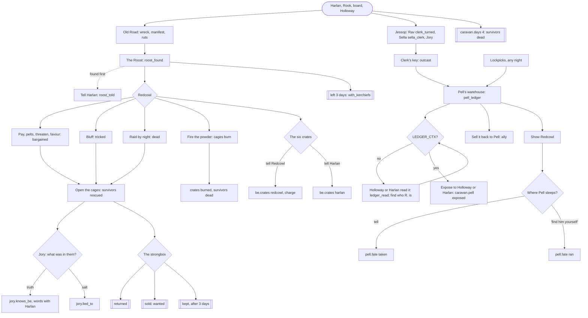

# Writing pass: Act 1, design and implementation spec

This is the single source of truth for the Act 1 writing pass: what the story
now is, every route and gate in it, every fact and journal line by exact
name, every case where something can be found before its quest is given, and
what is left to build in code. The whole arc it points at is
`STORY_BIBLE.md`; how people talk is `VOICES.md`.

**Status marks.** Every item carries one:

- **[DATA, done]**: written into `godot/data/content/` (or a text-only line in
  a zone script) and played by a named test. Nothing to build.
- **[CODE, done]**: built in code by the implementation pass, with the test
  that plays it. Section 11 has each one: what, where, the exact data, the
  choices made where the spec left room, and the test.
- **[CODE, to do]**: needs an implementer (none are left in Act 1).
- **[LATER]**: an Act 2 or 3 beat. Act 1 already records the fact it needs;
  the beat itself is in `STORY_BIBLE.md` sections 7 and 8.

Tests: `cd godot/tests && dotnet test` (298 pass). The pass's own scenarios
are `godot/tests/BreadcrumbTests.cs` (the code items' scenarios at its end);
four older tests in `QuestTests.cs` were given the context the new gates
require (section 13). The implementation pass added `RouteTests.cs` (every
road of Act 1 played end to end through the game's own conversations, the
Waystation, the Verge and its night fights, with a save and a load at the
turns that matter), `AuditTests.cs` (one play-through per bug the audit
found, section 15), the `Route` harness they share (`Route.cs`) and
`QaSaves.cs` (saves at the moments worth looking at in the real game).

---

## 1. The arc in one page

The full arc is `STORY_BIBLE.md`. In short:

- **Spine.** Under Thornhollow the Morrow, vast and alive, is chained by the
  Seventh Legion: seven links, each anchored in a heart kept by a Warden.
  Ember is its light and its pain. The chain is failing (the Ashford Fall, ten
  years ago). Vonnra, the last binder, needs an **Unchained** (one of the rare
  dead who rise with their mind) to walk through the Legion's dead and become
  a new link. She relit the Low Ford's lamps with Brannoc's irons and sent
  travellers across at night until one rose: the survivor. The survivor's first
  act, killing the Ford-Warden, loosed a heart; Grimtunnel took it down.
- **Act 1, The Waystation** (now): two troubles (the wolves, the caravan),
  three mysteries (the sealed door, the thing below, the lamps). Ends with
  Vonnra's fortune.
- **Act 2, The North Road**: the Dig breaks through under the Penhale farm;
  Keegan's chapter four; Holloway's letter and the boots; Harlan exposed; Pell's
  numbers; the Kerchiefs as the army; Brannoc's last two irons and a second
  crossing woken (a second Unchained); the Vigil's silver cages at Silverstair
  and Ysolde's brother in one; the turn: **you are Unchained**; the Vigil's war
  at the north gate.
- **Act 3, The Morrow**: Vonnra's truth; Jessop on the stair; the Warden's
  heart in Grimtunnel's hands; Chid's truth (he is Unchained too); the
  Legion's coin that buys one return; the Morrow prays to die. Endings:
  **re-forge** (someone Unchained lies down in the chain: the survivor, Chid,
  Vonnra, the second Unchained, or a caged stranger), **break** (no more ember
  anywhere; the Unchained die at dawn, but for the coin's holder), **take the
  light** (a new god).

Act 1 asks none of the big questions out loud. It plants all of them, and
records the choices whose weight lands later (section 9).

## 2. What changed, at a glance

| Thread | What is new | Status |
|---|---|---|
| Found early | Pell's ledger, the strongbox, the Roost, the cages and the Dig, each found before its quest, now start their story rather than finish it; people react to a survivor who arrives already knowing | [DATA, done] (dialogue gates and reactions); [CODE, done] C1, C2 (the strongbox's journal line, ledger objectives) |
| The Beast Problem | Snib explains his pump to a stranger, and will not move it for someone with no reason to care; Redcowl's charge as a way to blow the pump; Pell sells the charge only to someone who knows the Dig | [DATA, done]; [CODE, done] C6 |
| The Missing Caravan | Jessop named and missing; Harlan's greeting follows the days and the news; telling Harlan where the Roost is; the ledger read for its date; the six crates' fate; Jory told or lied to; who tells Redcowl where Pell sleeps; Harlan pays for the boy even after you sold his box | [DATA, done]; [CODE, done] C5 (the crates in an empty camp) |
| The Lamps at the Low Ford | A new mystery: the dead watchman's book, Corran and Dannet, Keegan, Brannoc's irons and his mark, Rook's money, the carters' notice, the square coin, Nell; the accusation at the fortune | [DATA, done]; [CODE, done] C3 (the prologue writes the first line) |
| Nell | Brannoc asks after his daughter; the truth buries her, a lie sends him to the gate | [DATA, done] |
| Seeds | Holloway's letter; Sella's pillow talk (quoted in the fortune); the Wayfinder's margin; Keegan after a death; Chid's "C"; Tam's knocking; Maeca and the Kerchiefs; Redcowl's "little bird" and "Ashford"; Rav names his brother | [DATA, done] |
| The fortune | Seven readings now (beasts, caravan, crates, Pell, self, before the ford, below), the accusation, the name | [DATA, done] |
| The chapter's end page | The lamps as an open thread; the new beats | [CODE, done] C4 |
| Implementation audit | Rewards taken once, choices that outlive their sense hidden, honest marks, no stale leads, what the world remembers across a save (section 15) | [CODE, done] |
| Fixes | The shrine-bell contradiction; retired words; Holloway's "my own toll clerk"; Rav's "eleven years"; a rule written twice; item lore that assumed you knew; morning reports in the wrong tense | [DATA, done] |

## 3. Shared gates

These conditions are used in several places. They are already in the data;
the code items in section 11 use them too. JSON as in `dialogue.json`.

| Name | Meaning | JSON |
|---|---|---|
| `CTX_KERCHIEF` | The survivor can know "R." is someone in red: Kerchief work seen or told of | `{"any":[{"quest":{"id":"caravan","entry":"wreck"}},{"quest":{"id":"caravan","entry":"ruts"}},{"quest":{"id":"caravan","entry":"roost_found"}},{"quest":{"id":"caravan","entry":"redcowl_met"}},{"quest":{"id":"caravan","entry":"redcowl_wagons"}},{"quest":{"id":"caravan","entry":"roost_raided"}},{"knows":"hint.roost"}]}` |
| `CTX_COYLE` | The survivor knows which night the ledger is about: the Coyle wagons | `{"any":[{"quest":{"id":"caravan","entry":"harlan_plea"}},{"quest":{"id":"caravan","entry":"guard_says"}},{"quest":{"id":"caravan","entry":"clerk_turned"}},{"quest":{"id":"caravan","entry":"wreck"}},{"quest":{"id":"caravan","entry":"redcowl_wagons"}},{"quest":{"id":"caravan","entry":"ledger_read"}}]}` |
| `LEDGER_CTX` | Both: the ledger proves something | `{"all":[CTX_KERCHIEF, CTX_COYLE]}` |
| `STREAM_CTX` | The survivor has a reason to think the water is the trouble | `{"any":[{"knows":"clue.green_stream"},{"knows":"clue.sick_wolf"},{"knows":"clue.analysis"},{"knows":"root_cause"},{"knows":"hint.stream"}]}` |
| `LAMPS_CTX` | Enough of the lamps to say it to Vonnra: whose irons, and whose coin or money | `{"all":[{"any":[{"quest":{"id":"lamps","entry":"irons"}},{"quest":{"id":"lamps","entry":"mark"}}]},{"any":[{"quest":{"id":"lamps","entry":"coin"}},{"quest":{"id":"lamps","entry":"rook"}},{"quest":{"id":"lamps","entry":"notice"}}]}]}` |
| `CRATES_FREE` | The six crates' fate is still open | `{"all":[{"not":{"fact":"be.crates","exists":true}},{"not":{"history":"burned_roost"}}]}` |
| `NELL_TRUTH` | Brannoc was told how Nell died | `{"any":[{"fact":"nell.told","eq":"gone"},{"fact":"nell.told","eq":"risen"}]}` |
| `PUMPING` | The Dig's pump still runs | `{"any":[{"not":{"fact":"dig.pump","exists":true}},{"fact":"dig.pump","eq":"running"}]}` |
| `COYLE_NAMED` | The survivor has heard the name Coyle | `CTX_COYLE` plus `{"quest":{"id":"caravan","entry":"roost_told"}}` |
| `JESSOP_KNOWN` | The survivor has heard of Jessop | `{"any":[{"quest":{"id":"caravan","entry":"clerk_turned"}},{"quest":{"id":"caravan","entry":"sella_clerk"}},{"quest":{"id":"caravan","entry":"ledger_read"}}]}` |

**The found-early principle.** A thing found before its quest gives a journal
line that stands on its own (it never assumes the quest), activates the quest,
and points at the person to take it to. That person reacts to a survivor who
arrives already knowing. A turn-in that proves something (exposing Pell,
moving the pump, accusing Vonnra) is hidden, not greyed, until the survivor
holds what it proves, because the choice's own words would give the answer
away. Instead an earlier choice is offered that turns the find into the next
breadcrumb.

---

## 4. The Beast Problem (`beasts`)

### 4.1 Graph


### 4.2 Breadcrumbs

| Trigger | Where, when | Adds | Status |
|---|---|---|---|
| "What's the talk?" | Rook, any time | `beasts/rumour`, `caravan/harlan_plea` | existing |
| Reading the board | Notice board | `beasts/holloway_bounty` (if unsettled) | existing |
| Meeting Holloway, Maeca, Wenna, Tam, Harlan | the square | `holloway_bounty`, `maeca_theory`, `wenna_request`, `tam_plea`, `harlan_view` | existing |
| "What are you pumping?" | Snib, at the Dig, while `STREAM_CTX` fails | `learn clue.pipe`; `beasts/snib_slurry`, quest active | [DATA, done] |
| Redcowl's charge | Redcowl, after `crates_keep`, while `PUMPING` | `give blasting_ember`; `redcowl.gave_charge`; `beasts/redcowl_charge` | [DATA, done] |
| Pell's blasting ember on his shelf | Pell's shop, once `root_cause` or `clue.blasting_ember` | the item, the same day | [DATA, done]; [CODE, done] C6 |

### 4.3 Order constraints

- Snib's offers to move, bribe, lamp-trick or fight over the pump need
  `STREAM_CTX`: nobody asks a foreman to move his outflow without a reason to
  care about the water. Without it Snib explains himself instead. [DATA, done]
- Pell sells the charge only to someone who knows the Dig (`root_cause`) or
  what "B.E." means (`clue.blasting_ember`). [DATA, done]
- Greymuzzle's "run with me" needs the Roost (`hint.roost` or `roost_found`).
  (existing)
- The bounty stops once Holloway is shown the cause after admitting the wolves
  are sick (`bounty.stopped`). (existing)

### 4.4 Found early

| Find | Before | Handled | Status |
|---|---|---|---|
| The Dig and Snib | any clue | Snib explains the pump (`snib.what`); the journal gains `snib_slurry`; the tracker then says fill a bottle and take it to Wenna (it already reads `clue.pipe`) | [DATA, done] |
| The pipe | Wenna | `clue.pipe`, `slurry_sample`; Wenna's analysis has a variant for the slurry | existing |
| The dead wolf | anyone | `clue.sick_wolf`; Holloway's "sick, not bold" opens | existing |
| Greymuzzle | the quest | `greymuzzle_met` activates it | existing |
| Pell's charge | knowing the Dig | gated | [DATA, done] |

### 4.5 Facts

| Fact | Values | Written by | Read by |
|---|---|---|---|
| `beasts.outcome` | `cured`, `allied`, `slaughtered`, `exploited`, `ignored` | rules `stream.clear`, `stream.clear_sold`, `wolves.gone`, `beasts.gate`; `greymuzzle.ally` | everywhere |
| `dig.pump` | `running`, `moved`, `broken`, `blown` | Snib, Pell (later), `Verge.cs` | rules, Verge, Act 2 beat 1 |
| `redcowl.gave_charge` | true | `redcowl.crates_charge` | Act 2 |
| `bounty.stopped`, `beasts.told_holloway`, `holloway.lied_to`, `wolf.blood`, `promise.pack`, `promise.broken`, `tam.pa_in`, `tam.farm`, `stream.clear`, `dig.sold`, `dig.pell_cut` | as before | as before | as before |

### 4.6 Journal (`quests.json` `beasts`)

All entries, exact text, in order. New: **`snib_slurry`**, **`redcowl_charge`**.

| Entry | Text |
|---|---|
| `rumour` | Wolves are attacking travellers on the Old Road. Everyone in the Waystation has an opinion about why. |
| `holloway_bounty` | Captain Holloway pays five gold a pelt, and fifty for the fang of Greymuzzle, the old alpha. "They're bolder," he says. |
| `maeca_theory` | Maeca Barefoot says the wolves are not hunting but running: something is driving them out of the deep wood. |
| `wenna_request` | Old Wenna says the animals were never like this. She wants a sample of the Thornhollow stream to test. |
| `tam_plea` | Tam saw wolves drink from the stream and fall down. "Something's killing them," he says. Nobody believes a child. |
| `harlan_view` | Harlan Coyle blames the wolves for his missing caravan. He wants them dead, all of them. |
| `clue.sick_wolf` | A dead wolf in the Verge with no wound on it: black gums, milky eyes, ribs like a washboard. |
| `clue.green_stream` | The Thornhollow stream runs green below the blight. Nothing grows at its edge. |
| `clue.pipe` | Upstream, a pipe of riveted iron spills warm, faintly glowing slurry into the water. |
| `clue.lampling_tracks` | Small clawed prints and the drag-marks of lamps, coming and going from the pipe. Lamplings. |
| **`snib_slurry`** | At the Dig, a lampling who calls himself the foreman pumps the waste of cooked ember down a pipe into the stream. "Stream is very obliging." |
| `sample` | You have a stoppered bottle of the green water. |
| `clue.analysis` | Wenna tested the water: ember slurry. It rots the gut of anything that drinks it, and someone is dumping it on purpose. |
| `root_cause` | The Dig. Grimtunnel's crew is pumping ember slurry into the stream to clear their workings. The wolves are sick, starving and afraid. |
| `greymuzzle_met` | Greymuzzle did not attack. The old wolf let you close, and showed you the sick ones. |
| `pelts_sold` | Brannoc bought wolf pelts from you. |
| `bounty_claimed` | Holloway paid the bounty. |
| `pump_broken` | The Dig's pump is wrecked. The slurry has stopped. |
| `pump_moved` | You talked the diggers' foreman into moving the outflow away from the stream. |
| `pump_blown` | You blew the Dig's powder. The pump, the pipe and a good part of the hillside are gone. |
| `alpha_dead` | Greymuzzle is dead. |
| `hollow_lost` | You went into the Hollow after dark to finish the Pack, and the Pack finished with you. Greymuzzle is still out there, and bolder for it. |
| `dig_overrun` | The Dig boiled over in the dark and you held its edge until nothing more came up. Grimtunnel went back down, bleeding. The pump is dead. |
| `dig_held` | The lamplings poured up out of the Dig in the dark and you could not hold them. The pump runs on. |
| `pack_led` | The Pack ran beside you into the Roost, and the Roost fell. |
| `told_holloway` | You told Holloway the beasts were dealt with. |
| `dig_sold` | You sold the Dig's location to Pell Varrow. |
| **`redcowl_charge`** | Redcowl gave you one charge out of the Coyle crates, for the Dig's pump. "Put it where it'll do the most harm to the right people." |

### 4.7 Code for this questline

C6 (conditional shop lines). See section 11.

### 4.8 Test scenarios

Section 12, B1 to B9.

---

## 5. The Missing Caravan (`caravan`)

### 5.1 Graph



### 5.2 Breadcrumbs

| Trigger | Where, when | Adds | Status |
|---|---|---|---|
| "What's the talk?" | Rook | `caravan/harlan_plea`; names Jessop | [DATA, done] |
| "Jessop, the toll clerk?" | Rook, while the caravan is unsettled | Rook on Jessop's rounds | [DATA, done] |
| Harlan's greeting | first meeting | `harlan_plea`, `beasts/harlan_view`, only while the survivors are unaccounted for; otherwise he greets the news | [DATA, done] |
| "I've seen your wagons..." | Harlan, `roost_found` and survivors unknown | `roost_told` | [DATA, done] |
| "Whose wagons are those?" | Redcowl, before the survivor has heard "Coyle" | `redcowl_wagons`, quest active | [DATA, done] |
| "I found this book..." | Holloway or Harlan, with the ledger and without `LEDGER_CTX` | `ledger_read`, quest active | [DATA, done] |
| "Your clerk. Jessop." | Vonnra, `JESSOP_KNOWN` | `vonnra.asked_jessop` | [DATA, done] |
| "Those six crates..." | Redcowl, `clue.blasting_ember` and `CRATES_FREE` | `be.crates` `redcowl`, `crates_redcowl` | [DATA, done] |
| "Your six crates are still in the Roost." | Harlan, `clue.blasting_ember`, `roost_found`, `CRATES_FREE` | `be.crates` `harlan`, `crates_harlan` | [DATA, done] |
| "What was in the crates?" | Jory, until answered | `jory.knows_be` or `jory.lied_to` | [DATA, done] |
| Picking up the strongbox | the Roost | `strongbox_found`, quest active; tracker step | [CODE, done] C1 |
| The ledger's next step | tracker; the wreck gold on the map | by context | [CODE, done] C2 |
| Vonnra's note under the door | tracker, from `chapter.ready` until the book is closed | "A Note in Violet Ink" | [CODE, done] (section 15) |

### 5.3 Order constraints

- The ledger exposes Pell (to Holloway or Harlan) only with `LEDGER_CTX`. The
  turn-in is hidden without it; the reading choice appears instead.
  [DATA, done]
- Telling Harlan about the crates needs the Roost and knowing what B.E. is;
  telling Redcowl needs B.E. They are exclusive (`CRATES_FREE`). [DATA, done]
- Jory's truth needs `clue.blasting_ember` (from Harlan's `be`, which needs the
  manifest from the wreck). The lie is always open. [DATA, done]
- Redcowl's "little bird" needs `redcowl_met`; "Ashford" needs his "who" and
  Maeca's barefoot story or her Kerchief answer. [DATA, done]

### 5.4 Found early

| Find | Before | Handled | Status |
|---|---|---|---|
| Pell's ledger (lockpicks, first night) | the caravan | Item text and `pell_ledger` read on their own; Holloway and Harlan read it for its date (`ledger_read`) and send the survivor to find who "R." is; exposing waits on `LEDGER_CTX`; Pell, bribing an ignorant thief, is relieved | [DATA, done]; tracker C2 |
| The Roost | Harlan | `roost_found` reads on its own and names Coyle (painted on the boards); Harlan greets a survivor with the Verge on their boots, and hears where his wagons are | [DATA, done] |
| The cages opened | Harlan | Jory's own line names him; Harlan's first greeting is the news ("Jory says it was you at the cage"), not the plea; his reward still pays; no plea is added to a settled quest | [DATA, done] |
| The strongbox carried in | Harlan | "That's my seal... Where's the boy?"; item text names Coyle Trading | [DATA, done]; journal line C1 |
| The strongbox sold, then the boy brought home | Harlan's reward | he pays for the boy anyway, once, and refuses you after | [DATA, done] |
| The wagons, by name | Harlan | Redcowl names Coyle (`redcowl_wagons`) | [DATA, done] |
| Jory, before Harlan | Harlan | Jory's `clerk_turned`; Harlan's greeting as above | [DATA, done] |
| The crates in an empty camp | Redcowl gone | Harlan can still be told; take a charge or sink them | [CODE, done] C5 |

### 5.5 Facts

| Fact | Values | Written by | Read by |
|---|---|---|---|
| `caravan.survivors` | `rescued`, `dead` | `Verge.cs` cages and fire, rule `caravan.starve` | everywhere |
| `caravan.cargo` | `returned`, `kept`, `sold`, `lost`, `with_kerchiefs` | Harlan, Rav, rules, `Verge.cs` | everywhere |
| `caravan.pell` | `exposed`, `ally`, `fled` | Holloway, Harlan, Pell, Redcowl | `Waystation.cs` presence, fortune, Act 2 |
| `caravan.days`, `caravan.box_taken`, `caravan.box_days`, `caravan.box_left` | as before | rules, `Verge.cs` | rules, Harlan, tracker |
| `redcowl` | `bargained`, `tricked`, `furious`, `dead` | Redcowl, `Verge.cs` | Verge, Standings |
| **`be.crates`** | `redcowl`, `harlan`; `sunk` (C5); `burned` the moment the Roost's powder goes up (unless Harlan's men have them); `dig` when the Kerchiefs sell the cargo on (rule `caravan.box_moved`); at the chapter's close, if still unset, `burned`, `watch` or `dig` (rule `crates.settle`) | `redcowl.crates_keep`, `harlan.crates`, `Verge.cs`, rules | Redcowl, Harlan, fortune, folk, concerns, Standings, `Verge.cs`, Act 2 beats 1, 5, 7 |
| **`crates.charge_taken`** | true | C5 "Take a charge" | C5 |
| **`corran.home`** | true | rule `holloway.corran` (the dawn after Holloway hears) | Holloway's concern, the town's talk |
| **`redcowl.gave_charge`** | true | `redcowl.crates_charge` | Act 2 |
| **`redcowl.birds`**, **`redcowl.ashford_said`** | true | Redcowl | Act 2 beat 7 |
| **`jory.knows_be`**, **`jory.told_knew`**, **`jory.lied_to`** | true | Jory | Jory, Harlan, rule `jory.words`, folk, concerns, fortune, Act 2 beat 5 |
| **`pell.fate`** | `taken`, `ran` | `redcowl.pell` | rules `pell.taken`, `pell.ran`, folk, concerns, fortune, Act 2 beats 4, 6 |
| **`harlan.told_dig`** | true | `harlan.be_dig` | Act 2 beat 5 |
| **`vonnra.asked_jessop`** | true | `vonnra.jessop` | Act 3 |

History events (new): `crates_redcowl`, `crates_harlan`, `told_jory`,
`gave_pell` (each spread 0: a private act, but on the chapter's page of deeds).

### 5.6 Journal (`quests.json` `caravan`)

New: **`roost_told`**, **`redcowl_wagons`**, **`ledger_read`**,
**`crates_redcowl`**, **`crates_harlan`**, **`jory_told`**, **`jory_salt`**,
**`pell_given`**, **`pell_hunted`**. Rewritten to stand on their own (*):
`clerk_turned`, `sella_clerk`, `pell_ledger`, `clerks_key`, `roost_found`,
`guard_says`.

| Entry | Text |
|---|---|
| `harlan_plea` | Harlan Coyle's caravan never arrived. His nephew Jory was with it. Harlan blames the wolves. |
| `wreck` | The caravan's wreck, off the Old Road: no wolf did this. Wagons were led off the road, and there is red fletching in the sideboards. |
| `ruts` | Wheel ruts turn off the road into the forest. Someone drove the wagons away, loaded. |
| `guard_says` * | The Watch swears the Old Road was never closed that day: Holloway had men on it from dawn to dusk. |
| `clerk_turned` * | Jessop, Vonnra's toll clerk, met Coyle's teamsters on the road, told them the Old Road was shut, and sent them down the forest track. He bought the Flagon a round that night. Nobody has seen him since. |
| `sella_clerk` * | Sella, upstairs at the Last Lamp: Jessop the toll clerk paid her in new silver with the Varrow mark on it, and bragged in bed that he had "sent some wagons down the wrong road". He has not been up her stairs since. |
| `toll_ledger` | Vonnra's toll ledger: the Coyle caravan never paid the toll. It never came through the gate at all. |
| `pell_ledger` * | Pell Varrow's ledger, from his own warehouse. Two payments on one night: forty to "R.", and ten to someone called Jessop, "for the road". In the margin, in the same small hand: "tell Holloway where they camp, after." |
| **`ledger_read`** | Pell's ledger, read by someone who knew the date: forty to "R." and ten to Jessop, the toll clerk, "for the road", both on the night the Coyle wagons vanished. Who is "R.", and what did forty buy? |
| `clerks_key` * | Jessop, the toll clerk, had a key to Pell Varrow's warehouse. He should not have had it. |
| `roost_found` * | Redcowl's Roost, the Kerchief camp in the ravine: the Coyle wagons' cargo under canvas (the name is painted on every board), and three prisoners in cages, with teamsters' hands. |
| **`roost_told`** | You told Harlan Coyle where his wagons are: the Roost, in the ravine, and three men in cages. He would pay anything to have them out. |
| **`redcowl_wagons`** | Redcowl calls the wagons in his camp salvage. A merchant at the Waystation called Coyle painted his name on every board of them. |
| `roost_raided` | You took Redcowl's Roost by night. Redcowl is dead, and the camp is yours to go through. |
| `roost_repelled` | You went at the Roost by night and were thrown back. The Kerchiefs are awake to you now. |
| `manifest` | A torn manifest: salt, cloth, iron, and six crates marked only "B.E." for a buyer called G. |
| `blasting_ember` | The "B.E." crates are blasting ember. Bound for the Dig. |
| **`crates_redcowl`** | You told Redcowl what is in the six crates marked "B.E.", and who they were bound for. He says nobody is having them now: not the Dig, not the Watch, not Harlan. |
| **`crates_harlan`** | You told Harlan Coyle where his six crates are. He thanked you, and reached for paper. Paid for is paid for. |
| `redcowl_met` | Redcowl, who leads the Kerchiefs, would rather talk than bleed. He says so, anyway. |
| `survivors_freed` | You opened the cages. Jory and the other two are free. |
| **`jory_told`** | You told Jory what he was carrying: blasting ember, for the Dig. He asked whether his uncle knew. |
| **`jory_salt`** | Jory asked what was in the crates. You said salt. |
| `survivors_dead` | The prisoners in the Roost did not survive. |
| `cargo_returned` | Harlan has his cargo back. |
| `cargo_kept` | You kept the Coyle cargo. |
| `cargo_sold` | Rav's friend bought the cargo, no questions asked. |
| `cargo_lost` | The Coyle cargo burned with the Roost. |
| `cargo_moved` | The Kerchiefs broke the Coyle cargo up and sold it down the south road. Nobody went back for it. |
| `pell_exposed` | Pell Varrow has been exposed. |
| `pell_joined` | You took Pell Varrow's money, and his side. |
| **`pell_given`** | You told Redcowl where Pell Varrow sleeps. |
| **`pell_hunted`** | Redcowl has gone looking for Pell Varrow. You did not tell him where to look. |

Added with code: **`strongbox_found`** (C1): "The Coyle strongbox, out of the
Kerchiefs' camp: heavy, locked, the Coyle Company seal on the lid. There is a
Coyle Trading Post in the Waystation."; **`crates_sunk`** (C5): "You rolled
the six crates marked "B.E." into the ravine's stream, one at a time, and
listened to each one not go off."

### 5.7 Who says what to a survivor who arrives knowing

| Person | Knows already | Says (node) |
|---|---|---|
| Harlan | the cages opened | "Jory says it was you at the cage with the bar in your hands" (`harlan.first`) |
| Harlan | carrying his strongbox | "That's my seal... Where's the boy that was driving it?" (`harlan.first`) |
| Harlan | the Roost | "You've the Verge on your boots... Tell me you've seen something." then `harlan.roost` |
| Harlan | the boy home, the box sold | "For the boy. I said I would." (`harlan.betrayed`) |
| Harlan | Jory told | "He knows. You told him." (`harlan.cb_jory_knows`) |
| Holloway, Harlan | the ledger, no context | read it for its date (`holloway.ledger_early`, `harlan.ledger_early`) |
| Pell | the ledger, no context | "You don't know what you're holding, do you? How refreshing." (`pell.confront`) |
| Redcowl | nothing about Coyle | "Some merchant up at the Waystation painted his name on every board" (`redcowl.wagons`) |
| Jory | (always) | "A toll clerk met us on the road, in Vonnra's violet" (`jory.first`) |
| Rook | the caravan settled | the rumours change with it (`rook.rumours`) |

### 5.8 Code for this questline

C1 (the strongbox), C2 (ledger objectives), C5 (the crates in an empty camp).
See section 11.

### 5.9 Test scenarios

Section 12, K1 to K16.

---

## 6. The Lamps at the Low Ford (`lamps`, new mystery)

A mystery like the vault: entries only, no outcome, never states the answer.
The journal assembles it; the survivor draws the line.

### 6.1 Sources

| Entry | Where it is learned | Gate | Status |
|---|---|---|---|
| `book` | the dead watchman's belt-book (prologue); also when the survivor raises it with Keegan (`keegan.warden`), Chid (`chid.warden`) or Holloway (`holloway.post`) | `lore.warden` | [DATA, done] for the three; [CODE, done] C3 for the prologue itself |
| `keegan` | `keegan.warden` | `lore.warden` | [DATA, done] |
| `post` | `holloway.post`: Corran, Dannet, no oil since his first winter | `lore.warden` | [DATA, done] |
| `irons` | `brannoc.irons`, `brannoc.mark` | none, or the lamp-iron | [DATA, done] |
| `mark` | `brannoc.mark` | `hasItem wardens_lampiron` | [DATA, done] |
| `rook` | `rook.ford2` | none | [DATA, done] |
| `coin` | `vonnra.coin` | met Vonnra | [DATA, done] |
| `notice` | `board.read` | `lore.warden` or `lamps/irons` | [DATA, done] |
| `nell` | `brannoc.nell` | met Brannoc, day 2 or later, not at night | [DATA, done] |
| `accused` | `vonnra.f_accuse` | `LAMPS_CTX` | [DATA, done] |

### 6.2 The accusation

In the fortune, after "And the door in the hillside...", a survivor with
`LAMPS_CTX` may say "You lit the lamps at the Low Ford." (`vonnra.f_accuse`).
She neither confirms nor denies (her voice never answers yes or no). She looks
at the survivor's face, not their hand, and calls them by name for the first
time; `f_door` and her hub after the chapter use it too. Effects:
`vonnra.accused`, `lamps/accused`, Vonnra respect +25 and trust -15, history
`accused_vonnra` (spread 0). Pays: Act 3 (she tells her truth in her own
words; the coin; ending A's Vonnra variant).

### 6.3 Journal (`quests.json` `lamps`)

Name: **The Lamps at the Low Ford**. Summary: "Somebody relit the lamps at the
Low Ford, and the Warden woke and drowned whoever crossed after dark. The Watch
says it was not them." `"mystery": true`.

| Entry | Text |
|---|---|
| `book` | The dead watchman's belt-book, at the post on the Low Ford road: "Lamps at the Low Ford lit again, and not by us. Not oil. Wrong colour." "Sent Dannet for the captain. Dannet not back." |
| `keegan` | Dame Keegan: the lamps were never meant to keep the dark out. They kept the Warden asleep. "If somebody lit them again, somebody wanted it awake." |
| `post` | Captain Holloway knew the dead watchman: Corran, written down as a deserter in the spring, and his runner Dannet with him. The Watch has had no oil for the ford lamps in years. |
| `irons` | Brannoc forged twelve new lamp-irons for the Low Ford last winter. Ten were collected at night, paid for in square old-empire coin left on the anvil. Two are still on his rack. |
| `mark` | The lamp-iron you took off the Warden has Brannoc's mark under the socket. It is one of the ten. |
| `rook` | Mother Rook is paid to say who comes up the Low Ford road, and when. She was paid double for you. |
| `coin` | Vonnra wears an old-empire coin on a cord at her throat: square, never spent. She says it will buy something that cannot be bought twice. |
| `notice` | On the notice board: carters wanted for the south road, toll work, paid double for a quick crossing. Apply at the Toll Tower. Someone has written underneath that quick means after dark. |
| `nell` | The girl holding the reins in the ditch on the Low Ford road, in new boots, was Nell, Brannoc's daughter: twelve, going south to her aunt with Wat the carter, on toll work. |
| `accused` | You told Vonnra she lit the lamps at the Low Ford. She did not say no. She said your name, and went on reading. |

### 6.4 Nell (Brannoc)

```mermaid
flowchart TD
  ask([Brannoc, day 2+, not at night, second visit or later]) --> q{'You pass them?'}
  q -- 'A girl had the reins' --> ditch[He puts the hammer down]
  ditch -- 'The water took her' --> gone[nell.told gone]
  ditch -- 'I put her down' --> risen[nell.told risen] --> quick{Was it quick?}
  quick -- yes --> thanks['Thank you': the one time]
  quick -- no --> price[He nods, as at a price]
  q -- 'I passed nobody' --> lie[nell.told lie]
  q -- 'I didn't look' --> evaded[nell.told evaded]
  gone & risen --> burial[[That dusk he goes down the road for her, alone or with the survivor (C14); at sunrise Chid meets him at the gate; they bury her by Ashe: nell.buried]]
  lie & evaded --> asking[[Two days on: he asks pedlars at the gate: nell.asking]]
  burial --> irons2[Hub: 'Those last two irons', brannoc.waits_buyer]
```

Walking away without answering leaves the question to be asked again (the
"asked" flag is set by each answer, not by the question). Rook and Chid
remember the truth (`rook.cb_told_brannoc`, `chid.cb_nell`); the town talks
(`folk.json`); his concern changes (`concerns.json`). Pays: Act 2 beat 8 (the
last two irons, the Kiln Ford, the second Unchained), Act 3 (the heart's
cage). The prologue now shows her red hair and new boots, so the scene
recontextualises a fight the player has already had. [DATA, done]

---

## 7. The Sealed Vault (`vault`) and the Thing Below (`below`)

Unchanged in structure (mysteries, found in any order). New:

- `vault/bootprints` (rewritten): "Fresh bootprints in the mud at the door,
  going in, not coming out. Trodden into one of them, a copper toll-token from
  the Waystation, stamped with three roads. Someone got inside." The narration
  in `Verge.cs` (`vaultprints`) says the same. Pays: Act 3, Jessop on the stair.
  [DATA, done]
- `below/tock` (new): "Tam says the ground under his family's farm knocks at
  night, like somebody asking to be let in. His Pa says it is moles." From
  `tam.tock` ("Anything else strange out at the farm?"). Sets `tam.tock`; the
  fortune's `f_below` then mentions the farm. Pays: Act 2 beat 1. [DATA, done]

---

## 8. Side threads and seeds

| Thread | Node(s) | Gate | Sets | Pays | Status |
|---|---|---|---|---|---|
| Corran and Dannet | `holloway.post`, `holloway.post2` | `lore.warden` | `holloway.post_told`; `lamps/book`, `lamps/post`; next dawn the Watch fetch Corran (rule `holloway.corran`) | Act 2 beats 3, 4 (Dannet's body, a Toll Tower pass) | [DATA, done] |
| Holloway's letter | `holloway.hub` variant, `holloway.letter` | night, day 3 or later | `holloway.letter_seen` | Act 2 beat 3 | [DATA, done] |
| Sella's pillow talk | `sella.morning` -> `sella.past`, `sella.sleeptalk` | after a paid night | `sella.heard_past`, `sella.sleeptalk` | Act 1 fortune (`vonnra.f_past`); Act 2 beat 11 | [DATA, done] |
| The Wayfinder's margin | `wayfinder.margin` and its three answers | met her | `wayfinder.name` = `given`, `nobody`, `false` ("Lark") | Act 2 beat 10 | [DATA, done] |
| Keegan after a death | `keegan.say_risen` | trait `risen_once` | `keegan.saw_risen` | Act 2 beat 2 | [DATA, done] |
| Chid and the "C." | `chid.note` | `lore.firstlamp` | `chid.note_asked` | Act 3 | [DATA, done] |
| Maeca and the Kerchiefs | `maeca.kerchiefs` | the Roost or Redcowl | `maeca.kerchiefs` | Act 2 beat 4; opens Redcowl's "Ashford" | [DATA, done] |
| Redcowl: the little bird | `redcowl.birds` | `redcowl_met` | `redcowl.birds` | Act 2 beat 7 (Rav's tip-off) | [DATA, done] |
| Redcowl: Ashford | `redcowl.ashford` | his "who", and Maeca's barefoot story or her Kerchief answer | `redcowl.ashford_said` | Act 2 beat 7 | [DATA, done] |
| Rav names his brother | `rav.cb_killed_redcowl` | history `killed_redcowl` | none | Act 2 beat 7 (Rav takes the hat) | [DATA, done] |
| Pell's sister's letter | `pell.t_pell` | after his "books" | none | Act 2 beat 4 (the boots) | [DATA, done] |
| Harlan, made to say it | `harlan.be_dig` | `root_cause` | `harlan.told_dig` | Act 2 beat 5 | [DATA, done] |
| Jessop | Rook, Rav, Sella, Vonnra, folk | various | `vonnra.asked_jessop` | Act 3 | [DATA, done] |

---

## 9. Seeds and their payoffs

Every Act 1 seed, the beat it pays, and when. In brackets, the bible's section and beat (7.1 is section 7, beat 1; 8 is section 8).

| Seed (where) | Carries | Pays | When |
|---|---|---|---|
| Six crates told to Redcowl (`redcowl.crates_keep`) | `be.crates` = `redcowl` | The Kerchiefs bring powder to the tunnels; the breakthrough fed one less [7.1, 7.7] | Act 2 opening and climax |
| Six crates told to Harlan (`harlan.crates`) | `be.crates` = `harlan` | The breakthrough wider; Harlan sold the ember that opened the farm [7.1, 7.5] | Act 2 opening |
| Crates never decided | `be.crates` = `dig`, `watch` or `burned` (rule `crates.settle`) | As above; the Watch's powder can collapse the hole [7.1] | Act 2 opening |
| Redcowl's charge (`redcowl.crates_charge`) | `redcowl.gave_charge` | Redcowl remembers whose side you took [7.7] | Act 2 |
| Jory told / lied to (`jory.truth`, `jory.salt`) | `jory.knows_be`, `jory.told_knew`, `jory.lied_to` | Harlan exposed by Jory; Jory on the south road [7.5, 7.8] | Act 2, first morning |
| Where Pell sleeps (`redcowl.pell_given`, `pell_hunt`) | `pell.fate` | Pell in Redcowl's cage, or back from the south; who holds the boots letter [7.4, 7.6] | Act 2 |
| Pell's sister's letter (`pell.t_pell`) | (dialogue) | The boots [7.4] | Act 2 |
| Nell (`brannoc.nell`) | `nell.told` | The last two irons; the Kiln Ford; the second Unchained; the heart's cage [7.8, 8] | Act 2 middle; Act 3 |
| The lamp-iron's mark (`brannoc.mark`) | `brannoc.saw_iron` | Brannoc hunts the coin [7.8] | Act 2 |
| "Buyer can come and ask me" (`brannoc.irons_after`) | `brannoc.waits_buyer` | The hooded buyer [7.8] | Act 2 |
| The carters' notice (`board.read`) | `lamps/notice` | Vonnra's truth [8] | Act 3 |
| The accusation (`vonnra.f_accuse`) | `vonnra.accused` | Vonnra's truth in her own words; the coin; she may take your place [8] | Act 3 |
| Jessop asked after (`vonnra.jessop`), the toll-token (`vault/bootprints`) | `vonnra.asked_jessop` | Jessop on the stair [8] | Act 3 |
| Pillow talk (`sella.past`) | `sella.heard_past` | The fortune quotes it (Act 1); what Vonnra knows [7.9] | Act 1 end; Act 2 |
| "You said a name" (`sella.sleeptalk`) | `sella.sleeptalk` | What you are [7.11] | Act 2 turn |
| Corran (`holloway.post`) | `holloway.post_told` | Holloway owes you; Dannet's body with a Toll Tower pass [7.3, 7.4] | Act 2 |
| The letter face down (`holloway.letter`) | `holloway.letter_seen` | Ask him before he decides [7.3] | Act 2 |
| Keegan after a death (`keegan.say_risen`) | `keegan.saw_risen` | Chapter four [7.2] | Act 2 |
| The margin (`wayfinder.margin`) | `wayfinder.name` | Sallow's ledger [7.10] | Act 2 |
| The knocking (`tam.tock`) | `tam.tock` | Who is home when the farm goes [7.1] | Act 2 opening |
| "Fed some of them" (`maeca.kerchiefs`) | `maeca.kerchiefs` | Maeca and the army [7.4, 7.7] | Act 2 |
| The little bird (`redcowl.birds`) | `redcowl.birds` | Rav's tip-off [7.7] | Act 2 |
| Ashford said (`redcowl.ashford`) | `redcowl.ashford_said` | The levy's story [7.7] | Act 2 |
| "Dunstan" (`rav.cb_killed_redcowl`) | history `killed_redcowl` | Rav takes the hat [7.7] | Act 2 |
| Chid's "C." (`chid.note`) | `chid.note_asked` | Chid's truth [8] | Act 3 |
| "I don't ask the salt" (`harlan.be_dig`) | `harlan.told_dig` | Harlan exposed [7.5] | Act 2 |
| Nell's red hair, Corran's beard (`Prologue.cs`) | (text) | Brannoc's and Holloway's scenes, Act 1 | Act 1 |
| The far bank (`vonnra.f_past` fallback), "Most do." | (text) | What you are [7.11] | Act 2 turn |

---

## 10. The chapter's end

**The fortune** (`vonnra`), read in order [DATA, done]:

1. `fortune`: "Sit. Give me your hand..."
2. `f_beasts`: the wolves (unchanged).
3. `f_caravan`: the caravan; new first variant when Jory knows what he carried.
4. **`f_ember`** (new): the six crates: Redcowl's tent; going home to Harlan;
   gone up with the Roost; still waiting, if the survivor knows what they are;
   or "marked with two letters" if they never learned.
5. `f_pell`: new first variant for `pell.fate` `taken` ("in a cage that was
   built for someone else").
6. `f_self`: unchanged.
7. **`f_past`** (new): with `sella.heard_past`, the survivor's own background,
   nearly word for word as they told Sella, "(She is not looking at your
   palm.)"; otherwise "The water took it, or you left it on the far bank. Most
   do."
8. `f_below`: new first variant when Tam's knocking is known; choices: "What
   about the door?" and, with `LAMPS_CTX`, "You lit the lamps at the Low Ford."
   (`f_accuse`, then `f_door`).
9. `f_door`: a variant with the name after the accusation; then "Close the
   book on this chapter." (action `fortune`).

The accusation is made once (`once: accuse`), and once the book is closed
("Your chapter is written") the fortune is not read again: her mark and the
tracker's "A Note in Violet Ink" go with it. `f_ember` has two more readings:
crates gone down the south road with the cargo (`be.crates` `dig` and
`caravan.cargo` `with_kerchiefs`), and crates that burned with the Roost
whether or not anyone was in its cages.

**The chapter page** (`godot/logic/World/Chapter.cs`): C4.

---

## 11. Code spec

Each item: what, where, the exact data, and how to prove it. Keep the house
style (`godot/README.md`): comments in short British prose that say why.

### C1. The strongbox, found, says whose it is and where to take it [CODE, done]

- **What.** Taking the Coyle strongbox in the Roost writes a journal line that
  stands on its own and activates the caravan, and the tracker always says
  where the box goes while it is carried.
- **Where.** `godot/logic/Play/Zones/Verge.cs`, the `strongbox` interactable's
  `Act`; `godot/logic/World/Objectives.cs`, `Caravan()`.
- **Data.** Add to `quests.json` `caravan.entries`, after `roost_found`:
  `"strongbox_found": "The Coyle strongbox, out of the Kerchiefs' camp: heavy, locked, the Coyle Company seal on the lid. There is a Coyle Trading Post in the Waystation."`
  In `Act`, apply
  `[{ "give": "coyle_strongbox" }, { "quest": { "id": "caravan", "status": "active", "entry": "strongbox_found" } }]`
  (the entry and its writer go in together: StoryLint fails on a line nobody
  writes).
- **Objectives.** While the box is carried and `caravan.cargo` is unset, show
  "Take the Coyle strongbox to Harlan Coyle, at Coyle Trading in the
  Waystation, or keep it", whatever `caravan.survivors` is (today it shows only
  once the survivors are settled).
- **Tests.** K4.
- **Done.** As specified. Also: a caravan settled at the cages while Harlan
  has not yet heard that Jory is alive keeps one step on the tracker, "Tell
  Harlan Coyle that Jory is alive", until he has (returning the box first and
  freeing the cages after resolves the quest at once, and the hundred for the
  boy was then nowhere on screen). `QuestTests.Say_how_long_the_cages_will_hold...`
  asserts it.

### C2. The ledger's next step follows what the survivor knows [CODE, done]

- **What.** The tracker's ledger lines follow `LEDGER_CTX`, so it never tells a
  survivor to show Holloway a book that would only be read for its date, or
  that cannot yet prove anything.
- **Where.** `Objectives.cs`, `Caravan()`; `Verge.cs` `MapMarks()`.
- **Steps** (optional steps, in this order, replacing the two ledger lines):
  1. Has `pell_ledger`, not `LEDGER_CTX`, no `ledger_read`: "Someone who knows
     the dates could read Pell's ledger: Captain Holloway, or Harlan Coyle."
  2. Has `pell_ledger`, `ledger_read`, not `CTX_KERCHIEF`: "Find out who \"R.\"
     is. Kerchief arrows are red-fletched; Rav Cutwell, at the Flagon, knows
     the Kerchiefs."
  3. Has `pell_ledger`, `LEDGER_CTX`, not `pell_exposed`, not `pell_joined`:
     "Pell Varrow's ledger: show it to Harlan, or to Captain Holloway"
     (today's line).
  Keep "Someone paid the toll clerk..." for `clerk_turned` without the ledger.
- **Map.** In `MapMarks`, mark the Coyle wagons as `Quest` also when
  `ledger_read` and not `wreck` (the red fletching is there).
- **Helper.** `H` gains `Any(params string[] entries)`; `CTX_KERCHIEF` also
  reads `Knows("hint.roost")`.
- **Tests.** K5b.
- **Done.** `H` has `Any(...)`; the two contexts are `KnowsKerchiefs` and
  `KnowsTheNight` in `Objectives.cs`, read exactly as `CTX_KERCHIEF` and
  `CTX_COYLE`. The tracker shows at most three steps, so with Harlan not yet
  met his "offering a reward" line (which points at the same man) may push
  "Ask Harlan about the crates" off the bottom: deliberate.

### C3. The dead watchman's book opens the lamps [CODE, done]

- **What.** Reading the belt-book in the prologue writes `lamps/book`.
- **Where.** `godot/logic/Play/Zones/Prologue.cs`, the `watchman` interactable.
- **Data.** Change its `G.Apply` to
  `[{ "learn": "lore.warden", "text": "The lamps at the ford feed the Warden." }, { "quest": { "id": "lamps", "status": "active", "entry": "book" } }]`.
  The entry already exists (written today by Keegan, Chid and Holloway too).
- **Tests.** L1.
- **Done.** As specified. Because the lamps now open on the Low Ford road,
  before anyone in town has asked the survivor for anything, the journal
  lists the troubles first and the mysteries after (`Book.cs`), so it opens
  on the Beast Problem, not on the lamps.

### C4. The chapter's page [CODE, done]

- **Where.** `godot/logic/World/Chapter.cs`.
- **Open threads.** `new[] { "vault", "below", "lamps" }`; show `lamps` only if
  the quest is active (it always is after C3, but a save from before may not
  have it). Update `QuestTests.Vonnra_reads_back_what_you_did_and_the_chapter_closes`,
  which asserts the list.
- **Caravan beats.** Add to `Pick(...)` after `roost_found`: `roost_told`; after
  `cargo_moved`: `crates_redcowl`, `crates_harlan`, `jory_told`; after
  `pell_joined`: `pell_given`, `pell_hunted`. Beasts beats: add
  `redcowl_charge` after `pump_blown`.
- **Epithet.** After "who runs with wolves": `vonnra.accused` gives
  "{name}, who said it to Vonnra's face".
- **Tests.** E2.
- **Done.** As specified, and `crates_sunk` (C5) is a caravan beat too. A
  Pell taken from his bed by Redcowl no longer also reads "Pell Varrow fled
  the Waystation in the night." (his `pell_given` line says what happened).

### C5. The crates in an empty Roost [CODE, done]

- **What.** If Redcowl is dead or tricked, or the Roost is cleared, the six
  crates stand in an empty camp. The survivor can take one charge, or roll the
  lot into the ravine's stream. (Telling Harlan where they are stays open.)
- **Where.** `Verge.cs`, `MakeInteractables`, at the cargo spot beside the
  strongbox.
- **Interactables.**
  - "Take a charge" (Name "The B.E. crates"): `When` = Redcowl `dead` or
    `tricked` or `roost.cleared`, `be.crates` unset, not `history burned_roost`,
    not `crates.charge_taken`. `Act`: `[{ "give": "blasting_ember" }, { "set": { "crates.charge_taken": true } }]`
    and say "You prise one charge out of the straw. The rest sit there and
    wait, the way they have waited for everyone."
  - "Sink them in the stream": same `When` without the charge condition. `Act`:
    `[{ "set": { "be.crates": "sunk" } }, { "quest": { "id": "caravan", "entry": "crates_sunk" } }]`
    and say "You roll them down into the ravine's water one at a time, and
    listen to each one not go off."
- **Data.** `quests.json` `caravan.entries`, after `crates_harlan`:
  `"crates_sunk": "You rolled the six crates marked \"B.E.\" into the ravine's stream, one at a time, and listened to each one not go off."`
  Fortune `f_ember`: add a variant before the `clue.blasting_ember` one:
  `{ "when": { "fact": "be.crates", "eq": "sunk" }, "text": "And six crates at the bottom of a stream, where nothing will ever buy them. That is the first thing you have thrown away that I approve of." }`
- **Act 2.** `sunk` counts as nothing reaching the Dig (bible 7.1).
- **Tests.** K14.
- **Done, with three choices.** (1) Both interactables need
  `clue.blasting_ember` as well: "Take a charge" and "Sink them" give away
  what B.E. is, and a survivor who never learned it sees six crates of
  somebody's salt (the manifest and Harlan's "be" are the breadcrumb). (2)
  While any of the Roost's crew stands within 16 m of the cargo, both are
  refused ("Too many eyes. Deal with them first"), as the cages are. (3) What
  is taken leaves the scene: the strongbox's chest when it is carried off,
  and the crates (and their colliders) once sunk, fetched by Harlan's men,
  sold on with the cargo, burned or taken by the Watch, now and on every
  visit after (`IZoneLook.HideProps`). A bluffed Roost empties at once
  (Redcowl and his crew leave the camp the moment the bluff lands), so
  nobody is left to call the survivor a thief or to watch the crates.

### C6. A shop line that becomes true is on the shelf when you next look [CODE, done]

- **What.** `RollStock` reads a line's `when` only at restock (every three days
  for Pell), so the blasting ember the survivor has just earned the right to
  buy would wait up to three days.
- **Where.** `godot/logic/Play/Journey.cs`, `OpenShop` / `RollStock`;
  `godot/logic/World/State.cs`, `ShopState`.
- **Fix.** Keep, per shop, the ids of conditional lines already offered this
  cycle (`ShopState.Offered`, a list, saved with the shop). On open, between
  restocks, add any line with a `when` that now holds and is not in
  `Offered` (rolling its `chance` as at restock), and record it. Restock clears
  `Offered`. Migrate old saves with an empty list.
- **Tests.** B9.
- **Done.** `ShopState.Offered` holds "index:item" keys (an item may have
  two lines in one shop: Harlan's draughts). A conditional line counts as
  offered once it has been rolled this restock, whether or not its chance
  came up, so reopening a shop never re-rolls a chance. Saves are version 2;
  a version 1 save counts the conditional lines whose item is already on the
  shelf as rolled (`An_older_save_counts_what_its_shelf_already_holds_as_rolled`).

### C7. Where you stand with the Kerchiefs (optional) [CODE, done]

- **Where.** `godot/logic/World/Standing.cs`, the Kerchiefs' "Tolerated" reason.
- **Data.** When `be.crates` is `redcowl`, the reason reads "Redcowl keeps the
  Coyle crates from the Dig, on your word." (after the colours check).
- **Tests.** One line in an existing standings test.
- **Done.** `BreadcrumbTests.C7_the_Kerchiefs_tolerate_whoever_kept_the_crates_from_the_Dig`.
  The reason replaces the bargain's only where the Kerchiefs already
  tolerate the survivor (telling Redcowl about the crates is not itself a
  pass).

---

## 12. Test scenarios

Each: setup, steps, expected. "Auto" names the test that already plays it;
"To write" goes with the code item named.

### The Beast Problem

- **B1. In order** (auto: `ObjectiveTests.Follow_the_Beast_Problem_whichever_way_it_is_walked`,
  `QuestTests.Talking_Snib_into_moving_the_pump_then_resting_cures_the_stream`).
  Meet Holloway; ask Maeca; hear Tam (`hint.stream`); bottle the green water;
  Wenna analyses; examine the pipe (`root_cause`); at the Dig, "Pump it into
  the old sinkhole" (arcana). Rest twice. Expected: `dig.pump` `moved`,
  `beasts.outcome` `cured`, quest resolved.
- **B2. The Dig first** (auto: `BreadcrumbTests.Snib_explains_his_pump_to_someone_who_does_not_yet_know_the_water_matters`).
  Fresh scholar walks to Snib. Expected: only "What are you pumping?" and
  "Leave" (and B.E. if known); choosing it gives `clue.pipe` and `snib_slurry`,
  not `root_cause`; moving the pump is still hidden; after learning
  `clue.sick_wolf`, "sinkhole" appears.
- **B3. Pipe before Wenna** (existing behaviour): examine the pipe, bottle the
  water, see Wenna. Expected: her slurry variant; `root_cause`.
- **B4. Hunt and lie** (auto: `QuestTests.Lying_to_Holloway_is_remembered`,
  `Holloway_confronts_a_liar_and_a_debt_paid_softens_it`).
- **B5. Run with the Pack** (auto: `QuestTests.A_hunter_can_walk_into_the_Hollow_and_speak_with_Greymuzzle`,
  `Running_with_the_Pack_outlasts_a_clean_stream`).
- **B6. Redcowl's charge** (auto in part: `BreadcrumbTests.Told_what_the_crates_are_for_Redcowl_keeps_them_from_the_hill_and_arms_you_against_it`).
  Then, in the Verge: the "Set a charge" interactable is offered at the pump,
  is set, and blows it: `dig.pump` `blown`, `pump_blown`, `dig.hostile`.
- **B7. Sell the cure** (auto: `QuestTests.Pell_buys_the_cure_and_the_stream_clears_on_his_terms`).
- **B8. Do nothing** (auto: `QuestTests.Left_alone_the_wolves_come_to_the_gate`).
- **B9. Pell's charge waits for the knowledge** (C6; `BreadcrumbTests.B9_Pells_charge_is_on_the_shelf_as_soon_as_the_survivor_knows_the_Dig`,
  `An_older_save_counts_what_its_shelf_already_holds_as_rolled`; played in `RouteTests.B2_...`). Day 1, open
  Pell's shop: no blasting ember. Learn `root_cause`; open the shop again the
  same day: blasting ember is there. Buy both; open again: not restocked until
  the cycle turns.

### The Missing Caravan

- **K1. In order.** Harlan's plea; the wreck (`wreck`, `manifest`); the ruts;
  the Roost (`roost_found`); pay Redcowl (`bargained`); open the three cages
  (`rescued`); take the box; give it to Harlan (`returned`, resolved).
  Auto in parts: `QuestTests.Redcowl_can_be_bluffed_or_bought`,
  `The_cargo_has_an_ending_of_its_own`, `ObjectiveTests.Say_how_long_the_cages_will_hold...`.
- **K2. The Roost first** (auto: `BreadcrumbTests.A_survivor_who_found_the_Roost_first_can_tell_Harlan_where_his_wagons_are`).
- **K3. The cages first** (auto: `BreadcrumbTests.Jory_home_before_his_uncle_ever_met_you_is_met_as_news_not_a_plea`).
  Expected: "bar in your hands", no "days late", no `harlan_plea`, the hundred
  paid.
- **K4. The strongbox first.** Auto (greeting):
  `BreadcrumbTests.A_strongbox_carried_in_cold_is_met_with_the_seal_and_the_boy`;
  C1: `BreadcrumbTests.K4_a_strongbox_taken_before_anyone_asked_says_whose_it_is_and_where_it_goes`. in the Verge with the caravan unknown, take the box. Expected:
  quest active, `strongbox_found`, the tracker's "Take the Coyle strongbox to
  Harlan Coyle..." step.
- **K5. The ledger on the first night** (auto: `BreadcrumbTests.A_ledger_burgled_on_the_first_night_starts_the_caravan_instead_of_ending_it`).
  Outcast burgles the warehouse with lockpicks before any caravan lead.
  Holloway offers "I found this book..." not "Here's his ledger"; reading gives
  `ledger_read`; still no expose; after `wreck`, "his ledger" exposes Pell.
- **K5b. The ledger's tracker** (C2; `BreadcrumbTests.K5b_the_ledgers_step_follows_what_the_survivor_knows`). After K5's first step:
  "Find out who \"R.\" is..."; after `wreck`: "show it to Harlan, or to Captain
  Holloway"; the wreck is gold on the map until found.
- **K6. Harlan reads the ledger** (auto: `BreadcrumbTests.Harlan_reads_the_ledger_too_and_sends_you_to_find_who_R_is`).
- **K7. Selling the ledger back, ignorant** (auto: `BreadcrumbTests.Pell_is_glad_of_a_thief_who_does_not_know_what_he_stole`).
- **K8. Whose wagons** (auto: `BreadcrumbTests.Redcowl_tells_a_stranger_whose_wagons_they_are`).
- **K9. The crates to Redcowl** (auto: B6's test). Expected also: Harlan's
  crates choice gone; the fortune's "bandit's tent".
- **K10. The crates to Harlan** (auto: `BreadcrumbTests.Told_where_his_crates_are_Harlan_sends_for_them`).
- **K11. Jory told** (auto: `BreadcrumbTests.Jory_told_the_truth_has_it_out_with_his_uncle`);
  **Jory lied to** (auto: `Jory_told_salt_believes_it`).
- **K12. Where Pell sleeps** (auto: `BreadcrumbTests.Who_tells_Redcowl_where_Pell_sleeps_decides_how_Pell_leaves`).
- **K13. Harlan pays for the boy** (auto: `BreadcrumbTests.Harlan_pays_for_the_boy_even_after_you_sold_his_box`).
- **K14. The crates in an empty camp** (C5; `BreadcrumbTests.K14_the_crates_in_an_empty_camp_can_be_broken_into_or_sunk`,
  `AuditTests.What_the_story_carries_off_is_gone_from_the_Roost`). Trick Redcowl out of the
  Roost. Expected: "Take a charge" gives one `blasting_ember` once; "Sink them"
  sets `be.crates` `sunk` and `crates_sunk`, and both interactables go; Harlan's
  "Your six crates" is gone; the fortune reads the `sunk` line; at the
  chapter's close `crates.settle` leaves `sunk` alone. Burn the Roost instead:
  neither interactable is offered.
- **K15. The crates settle** (auto: `BreadcrumbTests.When_the_chapter_closes_the_crates_go_wherever_nobody_stopped_them`).
- **K16. Harlan's days** (auto: `BreadcrumbTests.Harlan_counts_the_days_his_nephew_has_been_gone`).

### The Lamps

- **L1. The book opens the mystery** (C3; `BreadcrumbTests.L1_the_dead_watchmans_book_opens_the_lamps`). In the prologue examine
  the dead watchman. Expected: `lore.warden`; quest `lamps` active with `book`.
- **L2. Holloway's deserters** (auto: `BreadcrumbTests.Holloway_learns_his_deserter_died_at_his_post`).
- **L3. Brannoc's mark** (auto: `BreadcrumbTests.Brannoc_knows_his_own_mark_on_the_Wardens_lamp_iron`).
- **L4. The notice** (auto: `BreadcrumbTests.The_board_asks_for_carters_and_a_reader_of_the_watchmans_book_notices`).
- **L5. Nell, the truth** (auto: `BreadcrumbTests.Brannoc_asks_after_his_daughter_and_the_truth_buries_her`).
- **L6. Nell, a lie** (auto: `BreadcrumbTests.A_lie_to_Brannoc_sends_him_to_the_gate_to_ask_strangers`).
- **L7. Not on the first day, not at night, asked again if unanswered** (auto:
  `BreadcrumbTests.Brannoc_does_not_ask_on_the_day_you_arrive_nor_at_a_banked_forge`).
- **L8. The accusation, gated** (auto: `BreadcrumbTests.Vonnra_can_be_told_to_her_face_only_by_someone_who_has_the_pieces`).
  Without `LAMPS_CTX` the choice is absent; with `irons` and `coin` it is
  there; it sets `vonnra.accused` and `lamps/accused`; `f_door` and her hub use
  the name.

### Seeds and the chapter's end

- **S1.** Tam's knocking, the margin, Keegan after a death, Chid's "C." (auto:
  `BreadcrumbTests.Seeds_are_planted_where_the_story_will_come_back_for_them`).
- **S2.** Pillow talk in the fortune (auto: `BreadcrumbTests.What_is_said_in_the_blue_room_comes_back_in_the_fortune`).
- **S3.** Holloway's letter (auto: `BreadcrumbTests.Holloway_turns_a_letter_face_down_at_night_from_the_third_day`).
- **S4.** Rook's rumours follow the caravan (auto: `BreadcrumbTests.Rook_talks_about_whatever_is_still_unsettled`).
- **E1.** The fortune reads in order and closes the chapter (auto:
  `QuestTests.Vonnra_reads_back_what_you_did_and_the_chapter_closes`).
- **E2. The chapter page** (C4; `BreadcrumbTests.E2_the_chapters_page_reads_back_the_crates_Jory_and_the_accusation`). Settle both quests with Jory told
  and the crates given to Redcowl, accuse Vonnra, close the chapter. Expected:
  open threads `vault`, `below`, `lamps`; caravan beats include the crates and
  Jory lines; the epithet "who said it to Vonnra's face" unless the Pack ran
  with you.

### Every road, end to end (`RouteTests.cs`)

Played through the game's own pieces (conversations, the Waystation, the
Verge and its night fights, nights slept, a save and a load at the turns that
matter, asserting nothing is lost and the next step is the same):

- **The Beast Problem.** B1 in order (the scholar reads the water, Snib moves
  the pump); B2 the Dig first, a dead wolf as the reason to care, Pell's
  charge the same day, the pump blown; B6 Redcowl's charge; B7 the cure sold
  to Pell; B5 the hunter kneels and the Pack runs; B8 left alone; the wood
  emptied (slaughtered); the Dig boiling over by night; the Pack hunted in
  its Hollow by night.
- **The Missing Caravan.** K1 in order (wreck, ruts, the Roost bought, the
  cages, the box home); K2 the Roost first; K3 and K10 the cages first by a
  bluff and the box sold to Rav's friend, the arrest and the fine; K5 the
  ledger burgled on the first night, read, then proved; K12 where Pell
  sleeps; K16 too late, the box all that comes home; the box kept three days
  and the boy still paid for; the Roost raided by night, the camp empty, the
  crates sunk; the sealed door opened by night.
- **The Lamps.** Every piece, Nell told the truth, the accusation and the
  chapter's page.
- **The whole chapter** from the gate to the fortune, with a save at every
  turn, to the crates the chapter's close sends to the Dig.

### Wrong order, all hidden rather than greyed

Each is asserted in the tests above: exposing Pell before "R." is known;
moving the pump before the water matters; telling Jory the truth before
knowing B.E.; telling Harlan or Redcowl about crates whose fate is settled;
showing Brannoc a lamp-iron you do not carry; accusing Vonnra without the
pieces.

---

## 13. Fixed in this pass

- **Contradictions.** `folk.json` had Chid ringing the bell "twice this
  morning" while `rules.json` `shrine.bell` says he rang it for the first time
  anyone could remember: the line now waits for `shrine.lit`. Holloway called
  Jessop "my own toll clerk"; the clerk is Vonnra's. Rav had waited "eleven
  years" to see his brother run, before the Kerchiefs existed. Harlan's
  greeting said "four days" on every day, and asked after Jory after Jory was
  home. Rook's talk said the Coyle boy was missing after he was found. Item text
  named Harlan and Rav before the survivor met either.
- **Order holes.** The ledger could expose Pell before the survivor knew what
  it proved; Snib could be talked out of his pump by someone who had never heard
  of a sick wolf; Pell sold blasting ember (and the meaning of "B.E.") to
  anyone on day one.
- **Voice.** Retired words gone ("mostly", "Hm."); "catalog" is "catalogue";
  Redcowl says lass to a woman.
- **Data.** `rules.json` had `wolf.blood.washes` twice. Two morning reports
  told the coming day as past. `clerk_turned` and `guard_says` were worded for
  one of their two sources.
- **Lint.** StoryLint now sees items dropped where a fight ends
  (`SpawnPickup`): the Warden's lamp-iron is obtainable, and is wanted now.
- **Tests changed.** `QuestTests`: `Pells_ledger_shown_to_Holloway_exposes_him_and_Harlan_hears`
  and `The_morning_reports_who_heard_what` now give the survivor the caravan's
  context before showing the ledger; `Talking_Snib_into_moving_the_pump...` and
  `Snibs_bribe_is_a_deed` give a reason to care about the water. Each asserts
  what it did before.

## 14. Risks and open questions

- **Nell is a child's death,** the survivor's own doing in the prologue, told
  to her father. It is written plainly and without lingering (`VOICES.md`:
  violence in one plain line). The owner should read `brannoc.nell` and its
  branches and confirm the tone.
- **Act 2 is not built.** Act 1 now records about thirty facts that only Act 2
  and 3 read. They are harmless until then, and every one is in the ledger
  (bible section 10) so nothing is orphaned.
- **The fortune is longer** (nine pages). Each is one or two sentences; check
  the pacing in a real window.
- **Long greetings.** Harlan's new first-meeting variants run to about 300
  characters, like Rook's; check the conversation panel at 1080p.
- **`f_past` quotes the backgrounds' story text** in `archetypes.json` nearly
  word for word. If a background's story changes, change its `f_past` line.
- **C6 changed the save** (`ShopState.Offered`, save version 2): done, and
  a version 1 save is migrated (section 11, C6).
- **A strongbox kept three days** is Harlan's no more (`caravan.cargo`
  `kept`): it can still be fenced through Rav, but not given back. That is
  the writers' clock, kept as written; a late return would be a new choice.
- **Patch scripts.** The data was written by repeatable scripts kept outside
  the repo; the JSON is now the source of truth. Edit it directly.

## 15. The implementation audit

Act 1 played as a QA lead would, every road and the wrong turns between
them. Each finding is fixed and proved by a play-through in `AuditTests.cs`
(or a route in `RouteTests.cs`); content fixes were made in the data, in the
writers' words where a line was needed (VOICES.md).

**Rewards taken twice, choices that outlive their sense**

- Redcowl read Pell's ledger ("Give me that.") and handed it back: shown
  again, Pell's fate could be told twice, both ways; shown to Holloway, it
  put "in irons before dark" a man already gone. He keeps it now.
- Redcowl's hundred ("I'll throw in the teamsters... Open them yourself; my
  lads won't stop you") did not free the cages: his men still refused. It
  does now (`redcowl.releases`). The teamsters' keep (fifty) could be paid
  twice; he sold the strongbox to someone already carrying it.
- Rav slid Jessop's key across the table every time he was asked.
- Snib could be asked to move, shut off, be bribed over, or be fought for a
  pump already moved or broken, paying the bribe again; and said "Pump is
  still pumping" of a broken one. He now says what became of it (two lines
  in his voice) and is asked nothing about it.
- Vonnra's accusation could be made, and paid for in feeling, every time the
  fortune was read; her toll ledger was paid for every time it was asked
  about.
- Tam warmed to being believed every time he told it (twenty trust a time).
- Quest things could be sold over Rav's and Vonnra's counters: the strongbox
  sold there set nothing (no fence, no "wanted", the story never knew), the
  ledger or the sigil's fragment for a copper. Now nothing the story still
  needs goes over a counter or is dropped; each quest item says, in
  `items.json` ("needed"), how long it is needed, after which it is a
  keepsake that can be left behind.

**Gates and breadcrumbs**

- Greymuzzle met before the Roost was known showed "You would need somewhere
  to lead them", and never offered it again. He does now, to anyone who has
  not broken their word to him.
- The arrest's way out ("You should be asking who paid the Kerchiefs")
  exposed Pell with a ledger that proved nothing yet; it needs `LEDGER_CTX`.
- Harlan's question mark stayed up for good once Jory was home, and was up
  for a box he no longer wanted; Holloway's was up for a ledger he had
  already read and could not use. Marks now mean something to bring them:
  Harlan for the box, Jory's news and the Roost; Holloway while the ledger
  can be read or proves something; Vonnra until the book is closed.
- Leads were written into stories already over ("Harlan blames the wolves"
  after Jory was home, the bounty after the cure), from Rook, Holloway,
  Maeca, Wenna, Tam and Harlan. Harlan asked after a nephew who was home and
  offered a reward for him; Maeca met after the cure lectured about the
  bounty before she thanked anyone.
- The town spoke of Corran brought home, and of Aldo buried, the day before
  either happened.
- Sold to Pell, the Dig's step said "Stop the slurry" while Pell was doing
  it: it says to give him two days, or beat him to it.
- Journal notices were split at the first colon in a line, so a line with
  one put half of itself in capitals as a title: the quest's name is the
  title now.

**What the world remembers**

- Cages opened were open only until the survivor left the Verge, or loaded a
  save: on the next visit they were shut again, and once all three were
  open Jory could be let out of his cage a second time. They are the zone's
  memory now, and stay open.
- A Roost whose Redcowl fell first and his crew after was never "cleared".
- The Roost's powder burned "the prisoners still in their cages" after they
  had starved, and left the crates "still waiting in a ravine"; the cargo
  sold down the south road left them there too, to be told to Harlan. Now
  only the living burn, and the crates go with the fire or with the cargo.
- The strongbox's chest and the crates stayed on screen after they were
  taken or sunk.

**Reported by the CI review** (`docs/cloud/ci-health.md`, R1 to R4)

- **R1.** Once the stream ran clear, an allied or bought-off Pack still had
  blighted wolves in the Hollow and by the water: "sick" read only the
  `cured` outcome. The Verge now asks whether the stream runs clean
  (`stream.clear`, or cured), whatever settled the Pack.
- **R2.** After a slaughter nothing ever set `stream.clear`, so bitterroot
  grew on for good. Rule `stream.clear_slaughtered` clears it two days after
  the pump stops, with a morning line ("There is nothing left in the wood to
  drink from it.") and the `stream_cleared` deed.
- **R3.** A promise to the Pack broke on any wolf killed, even one that came
  for you (their kin worn into the Hollow). Only a wolf at peace with you,
  struck on purpose (neutral or provoked), breaks it now.
- **R4.** An allied survivor is never "who cleared the water": kept, by
  decision. Running with the Pack is the louder name (as E2 says) and has its
  own verdict; the pump's beat and the "stopped the poison" deed are still on
  the page.

Each is a play-through in `AuditTests` (R1 to R3 fail without their fix).
From the cloud branch's duplicate of C1 to C7, the tests that add coverage
and pass against this implementation were kept: the prologue's own watchman
(`PrologueTests`), the wagons' map mark from Turn to Quest to Place
(`VergeTests`), C7's line in the standings test and a shop saved with
`offered: null` (`WorldTests`), and `crates.settle` leaving `sunk` alone.

**Lint.** `StoryLint.Every_fact_written_is_read_or_is_a_seed_for_a_later_act`:
every fact Act 1 writes is read, or is one of the named seeds of section 9.

**Checked in the real game** (1920x1080, saves from `QaSaves.cs`, `--open
talk:ID>words>+` to reach a line deep in a conversation): the journal and
the tracker mid-caravan, Harlan's longest greeting, Brannoc and Nell, the
fortune's crates and last pages with the accusation, the chapter's page,
Pell's shelf with the charge, the Roost before and after the crates. Text
fits everywhere; the tracker wraps its longer steps to two lines.

## 16. The story explorer's findings (3 October)

The explorer (`docs/cloud/story-explorer.md`) found no softlock, dead end or
contradiction. It raised four things; each is settled here.

- **Wenna's mask** (`wenna.first` and `wenna.hub`, "That beaked mask on the
  wall..."). It wanted affection 20, which only two bitterroot deliveries (or
  one and the teamsters freed) could reach. A survivor who cured the stream
  first could never earn it, though curing it is the thing Wenna cares about
  most ("The stream's clean, child. Clean."). **Now:** affection 20, *or* the
  stream cleared by the survivor (history `stream_cleared`) and not sold to
  Pell (`beasts.outcome` not `exploited`). The curer's mask has her own line:
  "You cleaned my stream, child. Take it. ...Something down there's still
  cooking, and I'm too old to go where it's needed." (Act 2's bad air.) [DATA,
  done; `CinematicTests.Wenna_gives_her_mask_to_whoever_cleaned_her_stream`]
- **Keegan's supper** (`keegan.hub`, "It's late. Have you eaten?"). It is the
  romance's Act 1 beat (`docs/romance/`), so it should be reachable by the
  survivor who listens to her. **Now:** respect 25 and affection 10, at night,
  after the first dinner. The road, all in her own conversation:
  - tell her about the Ford-Warden (the dead watchman's book teaches
    `lore.warden`; `keegan.warden`, respect +15);
  - ask her about Ashe (Rook's first lamp teaches `lore.ashe`; `keegan.ashe`,
    respect +10);
  - accept the dinner ("Does the handbook say anything about dinner?",
    `keegan.dinner`, affection +10);
  - then come back after dark.
  Deeds that raise everyone's regard (the teamsters freed) can stand in for one
  of the first two. [DATA, done;
  `CinematicTests.Keegan_sups_with_whoever_listened_to_her`]
- **The cinematics' conversations** (`cin_*`). Nothing started them. Each
  trigger is now in `docs/cinematics/README.md` section 9, exactly. What could
  live without the cinematic player is live now [CODE, done]:
  - the opening's prints in the frost (C01);
  - the Warden's evening call, "Lie down." and "Is it morning?" (C02, C03);
  - Grimtunnel's "You smell like downstairs" and "ever so grateful" (C03);
  - the ember going "back into the ground" (C04);
  - "Them first." at the Roost (C06);
  - Nell's burial in the Quiet Garden on its morning, as a conversation (C08;
    the rule `nell.burial` sets `nell.burying` for that day only);
  - Redcowl's last words as the Roost raid's outcome (C11), so Rav's "the leg
    held" is reachable.
  The night fights' scenes (C10 to C14) wait for boss hooks on `ArenaSpec`.
- **`dig.pump = running`** was asked about and never written. **Now** a rule
  (`dig.pump.running`) writes it at the first dawn, as the state the Dig is in
  until someone moves, breaks or blows the pump; Act 2 reads it ("still
  running at the act's end"). [DATA, done; `CinematicTests.The_pump_runs_until_someone_stops_it_and_the_burial_is_one_morning`]

## 17. The editorial's cheap seeds, the town noticing, and the voice director's first reads (3 October)

What is in the data now, after the story editor's round five on this pass. All
[DATA, done] unless marked. Lines the editor asked to protect, and that are to be
recorded exactly as written, are marked *(protect)*.

**The explorer's full run** (16 survivors, 645,549 states, 30 minutes) found
nothing: no softlock, dead end, contradiction, gate that can never be met, or
unseen gate. Its search reached neither Keegan's supper nor Wenna's mask: it
never cured the stream (`beasts.outcome=cured` unseen) and never put Ashe's
trunk, Rook and Keegan in one road. Both are the search's limits, not the
story's, and neither is a finding, so nothing goes in `Accepted`. Both are now
played end to end through the game's own conversations and interactables:
`RouteTests.Wenna_gives_her_mask_to_the_scholar_who_cleaned_her_stream` (B1's
road, with Wenna's affection under 20) and
`RouteTests.Keegan_sups_with_whoever_read_the_watchmans_book_and_found_Ashe`.

**The editorial's seeds:**

- **"Gone to the Morrow"** (I-22): the valley's word for dying is the god's name.
  Three uses, no more:
  - Rook (`rook.valley`, from "Tell me about the Waystation": "Ashford was.
    *(protect)* Half of it went to the Morrow in one night, pet... Don't ask
    Holloway about it. Don't ask Maeca. Don't ask a Kerchief, if you meet one.
    And don't ask me twice."). The pair the player should connect is hidden in
    a list.
  - Old Oswin in the folk lines *(protect)*.
  - Wenna refusing it (`wenna.fever`: "Coughing green, then the sweats, then
    the— well. "Gone to the Morrow," they say up here, like it's a walk. They
    died, child.").
  - The idiom never sits beside the Order's call and is never a threat.
- **Wenna's tallow** (`wenna.tallow`): "I burn fat, child. Fat's honest. Fat was a
  pig." *(protect)* The art should give her shop tallow candles, never an ember
  lamp.
- **Chid's flame** (`chid.shrine`): "It was never for seeing by, you know; it was
  for keeping company." *(protect)*
- **Item lore** (LINE_NOTES 6.2 to 6.4), each line deniable, nothing stated:
  - the Ember Shard's quiet room *(protect)*;
  - Blasting Ember, "warm, like a stone a hand has only just let go of";
  - the slurry, "a little like a wound";
  - Grimtunnel's Spare Lamp, with "DOWNSTAIRS" scratched round its rim;
  - the Warden's Lamp-Iron, with "no well in it for oil, and no wick".
- **The carter wears thin** (I-10, LINE_NOTES 4.1). [CODE and DATA, done;
  `CinematicTests.The_carter_wears_thinner_with_every_death`]
  - `player.deaths` is counted at every fall (`Journey.Fell`).
  - The second death: "(He laughs, and stops.)"
  - The third: "(He isn't looking at you.) ...Well. Someone did."
  - The fourth and after: "The carter sends his regards."
  - From the third: "Which carter, Chid?" (`chid.carter`: "I never asked his
    name... Next time... There's nothing in it but hot." *(protect)*).
  - A folk line from the second: "No carter's been up the Old Road in a month.
    So who keeps bringing that one in?"
  - The truth (bible, Chid): he carries the survivor in himself.
- **The nemesis names** (LINE_NOTES 4.2): "Red Hob" and "the Ditch-Walker"; Wat
  and Corran are never a monster's name. [CODE, done]
- **The trait** (Problem 4, LINE_NOTES 4.4): `risen_once` reads "You fell, and got
  up again."
- **Maeca keeps Ashford** (LINE_NOTES §5).
  - Her first line ends "Maeca. Barefoot, before you ask.", and her plate is
    "Hunter, of the Hollow".
  - The word is earned from Rook, Wenna and Holloway first.
- **Keegan names the kenning** (THE_EMBER_REVEAL §5.2), in `keegan.vonnra`, once
  she has met Vonnra: "Ash-of-Morrow. A peculiar sort of surname: a kenning,
  almost. The ash of the morning; what is left when the morning has burned
  down. ...I have no opinion of her. Chapter two forbids opinions about
  civilians. I have several."
- **The first hint** (LINE_NOTES 2.8) is only "Keep moving. Your weapon strikes on
  its own." [CODE, done]

**The town notices** (I-15, LINE_NOTES 10). [CODE and DATA, done;
`CinematicTests.The_town_stops_saying_what_has_stopped_being_true`,
`Brannoc_says_twelve_once_in_a_playthrough`]

- How it works: a person's `said` barks (`npcs.json`: `{text, when, night,
  once}`) hold only while the world is a certain way.
  - The zone offers them for half of that person's barks.
  - A `once` line is said at the first chance it holds, and never again
    (`ZoneRuntime.Wire`, `FirstTime`, `MarkSaid`).
  - Voice ids are `bark.<npc>.said.<i>`.
- Every bark that stopped being true moved there, with the condition that keeps
  it true.
- Each person gained a line for what the survivor settled. Protected:
  - Brannoc: "Low Kiln's three days. She'll be there by now." *(protect)*
  - Brannoc: "Forge is lit. Don't come in." *(protect)*
  - Brannoc, once: "Twelve, I made."
  - Rook: "Hook's empty. I know. Leave it." *(protect)*
  - Harlan: "Coyle and Nephew, the new sign was going to say. Coyle and—"
    *(protect)*
  - Harlan: "Mister Coyle, he calls me. In my own shop." *(protect)*
  - Harlan: "He sleeps with the lamp lit. So do I, now." *(protect)*
  - Wenna: "Clean water, and nothing left in the wood to drink it." *(protect)*
  - Chid: "Two candles in for her. One's for Brannoc; don't tell him."
    *(protect)*
  - Rav, after Redcowl's death: "Man owed me a leg, pal. Bad debt, now."
  - Tam, after he has told it (`tam.tock`) and the ground has moved: "Still
    knocking under our floor. Pa's stopped saying it's moles."
- Repeating a word for weight is Chid's and Keegan's only (`VOICES.md`).
- **Funerals** stop saying "this morning" for ever: "Wouldn't let anyone spell
  him." *(protect)*

**From the voice director's reads** (Chid, Maeca, the Wayfinder):

- **Bare speech tags go** where the voice carries the speaker. Tags that carry
  manner stay.
- On the third night the pause before "What were you?" is shown: "Against your
  chest you feel her lips move, without a sound." *(protect)* She is counting
  the heart she tells you about at dawn.
- **Chid after the burial** (`chid.cb_nell`). [`CinematicTests.Chid_never_tells_a_mourner_what_she_saw`]
  - Never on the burial morning before it.
  - To a survivor who stood at the grave: "I sang it flat. I always have.
    There's always somebody who has the tune." *(protect)*
  - Both variants end: "...Sit down a minute. (He moves up the bench, though
    there's nobody else on it.)"
- **The Wayfinder's opener**: "You've the look of someone who'll want a second
  map. Good. Most only ever buy the one." "Comes back" is the ledger's word, and
  she never spends it on meeting.
- **The bosses speak as themselves.** [CODE, done;
  `CinematicTests.Grimtunnel_never_finishes_surface_meat_at_her_after_the_ford`]
  - The Barrow Lord's orders go to his dead, so they are plural: *Tenete*,
    *Iungite*, *Testudo*.
  - Grimtunnel's title is *Ever So Grateful*.
  - Since C03 he never finishes "surface-meat" at her: "Ha! Keep upstairs,
    surface-m— you! I'm wanted DOWNSTAIRS!" C12 reads "Surface-m— ...You broke
    my PUMP."
  - Snib's line is protected *(protect)*.

**Signature phrases are not shared** (`VOICES.md`):
- "Someone always does" is Vonnra's (C09 turns on it);
- "before you ask" is Maeca's;
- "Not there... Here." is Keegan's.

## 18. Lines made final for recording (the ElevenLabs packets)

Each character's packet (`docs/voice/elevenlabs/`, on the voice branch) is read
line by line against the data before the owner records it. What that reading
changed:

- **Delivery directions are lower case** inside a person's line (`VOICES.md`):
  "(quietly)" for Redcowl's "Don't."; "(very precisely)" for Keegan;
  "(a breath out through his nose)" for Rav; "(a long breath, through the
  nose)" for Brannoc; "(a long breath)" and "(not unkind)" for Maeca. The
  actor plays them; the narrator never reads them. Narration in parentheses
  is a capitalised sentence ("(A whistle from the ridge. The whole camp
  stops.)").
- **Maeca's second night** (`maeca.blind2_feet`): "Then, into the dark, very
  low: "Your hands are colder than my feet." She doesn't take them back."
  (no "(A pause.)" for anyone to read aloud).
- **The narrator's sinkhole** (`Verge.cs`, LINE_NOTES 3.1) no longer winks:
  "...bigger than a house. It does not move. You watch it long enough to be
  sure, and you are not." The journal: "It does not move."
- **The Hollow knows** (`Verge.cs`): "They smell the blood on you before they
  see you: one of theirs, since you last slept." (not Maeca's rule quoted back).
- **Tam's Pa fetched** (`tam.fetch`): "...and go on into the trees for his Pa.
  He calls you several things on the way back, and one of them is a fool. But
  he comes."
- **Rav's back room**: "a shelf of jars, one of them moving, and" (no
  parenthesis inside narration).
- **Rook's gossip** no longer repeats her callback's joke: "Jory Coyle's home,
  asleep in my good room with the lamp lit, and Harlan's been up my stairs four
  times to look at him."
- **Sella's night barks** both opened "Rook's walls are thin": `bark.sella.night.1`
  is now "I've a bath going cold upstairs. Shame to waste it."

## 19. The voice up the road, and the story's share (4 October, the owner's questions)

- **Vonnra is not the narrator** (bible, section 2, "Who tells it"). She is the
  voice that calls the survivor up the road at the waking, once and unnamed:
  - `cin_drowned_fire.lamp` (narrator): "Far up the road one lamp burns high in
    the dark, and a voice comes down to you over the frost, close as if she
    stood at your shoulder."
  - `cin_drowned_fire.call` (speaker `far_voice`, "A voice up the road"): "Come
    up, traveller. ...No charge, this once."
  - The same pair is in the prologue's captions (`Prologue.cs`), so the call
    plays before the cinematic exists.
  - C01 has two placeholder shots for the cinematics lead to frame (8a, 8b).
  - The fortune already opens on the same words.
  - [DATA and CODE, done;
    `CinematicTests.The_voice_that_calls_her_up_the_road_opens_the_fortune`]
- **Pacing** (bible, section 2, "Pacing"):
  - early on, the story is two parts in five;
  - a story night is 20 minutes, and a Wayfinder's map is 30;
  - the endgame has two kinds of arena: permanent (the Wayfinder's atlas, the
    build game) and a night's scar (the survivors' game).
  - Combat sets the clock. The story asks that no announcement say "half hour"
    on a 20-minute night.

## 20. The night's last line, the table's names, and phase 3's crafters (4 October)

- **A story night ends on its own line** (the editorial's I-7, LINE_NOTES 3.4):
  `ArenaSpec.EndWon` and `EndLost`, set in `Verge.cs`, take the place of "The
  story goes on." on the result screen. A lost one adds "The fight waits on
  the Wayfinder's table, to be taken again." A rematch keeps the won line and
  drops the lost one, since it sends her back to the table, not where the line
  says she comes to. Every lost night is a fall, so each lost line is her
  coming to. None claims the dawn: she comes back into the same night.

  | Night | Won | Lost |
  |---|---|---|
  | The Hollow by Night | "The Hollow is quiet. The only breath in it is yours, and it does not show in the cold." Spared: "Behind you, in the den's mouth, an old wolf is breathing. You leave him to it." | "You come to at the Hollow's mouth with your collar wet from a wolf's jaws. Nothing ate you. Something carried you out." |
  | Raid on the Roost | "The red hat lies in the mud. By the fires, someone is telling the children to hush, and they do." | "You come to on the road below the Roost, laid out straight with your hands on your chest, the way the Kerchiefs lay out their dead." |
  | The Dig Boils Over | "Nothing more comes up. A long way under your feet, the ground goes still, the way a room does when someone has said your name." (C12's "It went ever so QUIET!"; Act 3's names) | "When you come to, they have gone back down the hole, and taken their own dead with them." |
  | Behind the Sealed Door | "The dead stand aside and let you up the stair. They did not do that for the last one." (Jessop, C13) | "The dead carry you back up the stair and put you out, the way you would put out a cat." |

  C14's night (Wat) gets its pair when combat builds the fight.
  [CODE and DATA, done; `VergeTests` holds that every story night has both.]
- **And the town hears it in the morning** (`rules.json`, once each):
  - `hollow.killed`: "Just before dawn the Pack howled from the Hollow, all of
    them together, once, and not again. Maeca was through the east gate the
    moment it opened, and did not say where she was going. Nobody asked."
  - `hollow.spared`: "Tam says he saw an old grey wolf on the ridge at first
    light, walking slow, and it stood and looked at the town for a long time
    before it went. Nobody believes him."
  - `roost.cairn`: "Lamps moved in the ravine all night. At first light there
    was a cairn at the top of the Roost road, where the Old Road can see it.
    The Flagon's back room stayed shut all morning, and nobody saw Rav go out."
    (The brother, for those who are listening.)
  - `dig.quiet`, when the fight did not blow the pump (`dig.burned` tells that
    one): "The hill over the Dig stayed dark after you came down from it. At
    first light Snib was sitting on an upturned bucket at the pit mouth, with
    his chin in his hands, waiting for somebody to tell him what to do."
  - `vault.watched`: "Vonnra came down from the toll tower before dawn, which
    nobody has seen her do, and walked out along the Verge road and back. She
    paid the gate-guard for his trouble, and told him he had not seen her."
- **No "alpha" anywhere:** the bounty notice ("fifty for the old grey
  dog-wolf"), Holloway's locked choice ("Bring pelts, or Greymuzzle's fang")
  and the day kill's deed ("the Pack's old dog-wolf"). `StoryLint` now reads
  the content and the scripts' deeds, lines and announcements for alpha,
  warlord and ganger.
- **The result screen's other words:** "THE NIGHT IS HELD" (was "THE ARENA IS
  WON"); "Your longest night yet"; a table night won, "The Wayfinder will want
  it for her margins." The story night's hint: "An ember arena: won or lost,
  the valley hears of it" (was "the story remembers how it goes").
- **The arena's own words:** "Brought down by a Kerchief Footpad" (an article
  for one of a kind, none for a name: `Enemies.Called`); "until the
  Pack-Mother comes" (`MapOffers.InSentence`); "is down: the night is held";
  "end it" for "beat it"; no "It" for a boss who may be a man; the table's
  "Wolfbane gear, or gear of the Wolf".
- **The table names its maps in the valley's words** (bible, "The nights"):
  `MapOffers.Names`, per people. "The Weeping Wood" and its kin are gone.
  [CODE, done; `StoryLint`.]
- **Phase 3's crafters, written ahead** (`crafting.json`; inert until crafting
  adds their verbs):
  - **Vonnra binds** at the Toll Tower. No `{name}` and no "traveller" in her
    lines, so they hold before and after the fortune. The first binding: "There.
    It let go. Everything does, if one is patient with the lamp. ...It has
    somewhere to be now. That is all anything wants." (It is what she means to
    do with the survivor, and C43's "That is all I ever wanted" answers it.)
    `terms.accused` is the line for the tenth off: "She charges you a tenth
    less. She does not say why."
  - **The mark** (endgame): "Marked. It will do it that way now, until it
    breaks." (The design's "It will not forget" was the retired "I will not
    forget" in other clothes.)
  - **Snib's jars:** "It is the GOOD stuff. Snib would not drink it. Snib would
    not drink the bad stuff EITHER." (no "Mostly", which is retired). The first
    steeping: "...and something in the jar moves to meet it." / "There!
    Steeped! Snib did not see it move. It did not move."
  - Narration in a `.before` slot carries no parentheses (the slot is already
    the narrator's): Brannoc's fang and Maeca's braid lost theirs.

## 21. The story fights' words (4 October; combat's STORY_BOSSES.md, pending the owner)

The new story fights are three beats ended by goals, then the boss, then the
ending cinematic (C10 to C13). Combat holds these lines in its fight data. The
pull names the place, never a clock. A line between beats is a sight, not a
feeling. Nothing here says what the horde is.

| Fight | The pull | After beat 1 | After beat 2 |
|---|---|---|---|
| The Hollow by Night | "The ember takes you down the clough, into the Hollow. The stream is loud here, and it smells wrong." | "The howling stops. In the quiet you can hear the stream, and something in the brush coughing." | "The deadfalls burn. Past them is the den's mouth, and in it, grey shapes that do not get up." |
| Raid on the Roost | "The ember takes you up the ruts below the Roost. Somewhere above, a whistle, and another answering." | "Three whistles, and none answering. Ahead, the cage yard: four cages, and the fourth stands open with nobody in it." | "Past the cages, the camp's fires, and the levy forming up the way they were taught: in step, pikes level." |
| The Dig Boils Over | "The ember takes you to the edge of the Dig. Every lamp in the hole is coming up at once." | "The last windlass goes over. Down the tub-way the brake-house lamp is lit, and the rails are singing." | "Past the brake-house stands the pump-house, and every lampling between you and it is carrying a crate." |
| Behind the Sealed Door | "Through the door: a long hall, and the head of a stair. On the stair, something is coming up in step." | "The first ranks are down. The hall runs on ahead, long and straight, and at the end of it something is winding a great bow." | "Down the hall, three standards go up one after another, and the dead turn to face them." |

- **The fights' own voices:**
  - Old Blue (wordless): "(Old Blue howls from the rock, and every wolf in
    the clough answers.)"
  - The pickets: "(A whistle, short and sharp. Another answers it, further
    up.)" and "Lights! Lights on the ruts!"
  - Redcowl: "Red to me! Up, my lot!" At his last stand, behind the carts:
    "(A child, crying for its mam.)", then cold: "Mind where you swing." (his
    arrival's last words, C11, come back).
  - Snib, in third person:
    - "Not the WINDLASS! Snib has to wind that! Snib does not wind it. The
      lads wind it."
    - "Mind the tubs! Tubs are EXPENSIVE. Tubs are Boss's."
    - "That is the Boss's SPARE! You cannot have the spare. ...You have the
      spare."
    - "The PUMP! Who will pump? Snib will not pump."
  - Grimtunnel (first person, possessive; never finishes "surface-meat" at
    her):
    - "Still upstairs, are we? Downstairs'll want to hear about THIS."
    - "Nobody's! Nobody's having my lamps!"
    - "Ever so patient, downstairs is. I'm NOT."
    - "Put that lamp DOWN, surface-m— you. That's MINE."
  - The Signifer: "Signa!"
- **Freeing the caravan's men in the raid** (beat 2) is the cages' own rescue:
  `caravan.survivors` = `rescued`, `survivors_freed`, the caravan settled, and
  the deed `freed_teamsters`, with the cage lines and Jory's "Is my uncle—?".
  The fourth cage stays empty and open (Ewan).
- **Greymuzzle's end** becomes her choice when the promise and the clean
  stream hold: "Let him go" or "Finish it". "Finish it" breaks the promise.
- **C13:** she lays the Barrow Lord down, he will not stay down, and he rises
  within her reach for the hand and "Redi." (the bible, "The nights").

## 22. The owner's decisions on the story fights, the day's clock and the first chart (4 October)

The owner approved the story fights and the clock, with five decisions
(`docs/design/STORY_NIGHTS_AND_TIME.md`, at the top). This is what they made
of the words.

### 22.1 Spare or finish, at his side

- **The hook** (agreed with combat): `ArenaSpec.OnSpare`, `EndSpared` and
  `SpareVerb`. The choice is offered only where `OnSpare` is set. Two prompts
  wait at his side with no clock: `SpareVerb` and "Finish it". The choice
  applies its outcome first (`Arenas.Won(j, spec, spared)`), then the end
  hook plays. Left unsaid, `Won` falls back to `Spare`, today's automatic
  let-go. The specs live in `logic/Play/StoryFights.cs` (experience moved
  them out of the Verge).
  [CODE and DATA, done; `VergeTests.Redcowl_on_his_knee_is_hers_to_spare_or_finish`,
  `Greymuzzle_let_go_is_her_choice_and_finishing_him_breaks_the_promise`]
- **Greymuzzle:** "Let him go" or "Finish it", only when the promise and the
  clean stream hold. Finished, the promise she knelt to make is broken with
  him (`promise.broken`, the deed `broke_promise`: "knelt to Greymuzzle and
  promised him a cure, and finished him on his own den floor").
- **Redcowl:** "Spare him" or "Finish it".
  - Finished: C11's death part, his last words (`last`), and the red hat in
    the mud, as before.
  - Spared: C11's new parts. The conversation's entry plays `spared` once
    `redcowl` is `spared`, so the outcome is applied before the hook.

    | Node | Variant | Line |
    |---|---|---|
    | `spared` | `redcowl.ashford_said` (lass, lad) | "(a laugh, and it costs him) Ha! ...You said a word in my camp once, and I let you. Now you've let me. That's us square, lass. ...Near enough." |
    | `spared` | otherwise (lass, lad) | "(a laugh, and it costs him) Ha! ...You minded where you swung. That's two I owe, then, lass. The saw-bones a leg, and you the rest of me." |
    | `flit` | | "(cold, to her) We'll be off your road by light. (to the camp, the big voice back) Up, my lot! Boots on! We're flitting!" |

    - "You minded where you swung" pays "Mind where you swing" (the bairns).
    - "Two I owe" pays "Redcowl owes Rav a leg".
    - He never says the word: that is spent dying.
    - "Up, my lot!" is his rally from the fight.
    - A flitting is a move made by night.
  - The result's last line (`EndSpared`): "He walks back through his people,
    and does not limp until he is past the fires. Behind the carts, someone is
    waking the children and telling them to hush." (It mirrors the killed
    line's hush, and the leg holds.)
  - What it sets (`OnSpare`): `redcowl` = `spared`, `roost.cleared` (the camp
    struck by first light), the entry `caravan/roost_spared`, the deed
    `spared_redcowl` (the Kerchiefs' respect; Rav's affection and trust,
    Maeca's and Holloway's respect), and `pack_led` as after a kill. It sets
    neither `redcowl.last_words` nor `roost.hostile`.
  - The six crates go with him only if he swore to keep them (`be.crates` =
    `redcowl`). Otherwise they wait in the empty Roost with the Coyle cargo,
    as after a kill, and the Watch has them at the act's end
    (`crates.settle`).
  - The journal (`roost_spared`): "You took Redcowl's Roost by night, and let
    him get up off his knee. He is taking his people off the Old Road before
    first light, and leaving the Coyle wagons where they stand."
  - Every later beat reads the right fact:
    - the morning report `roost.flitted`: "Before first light the wall saw
      torches come up out of the ravine and go north over the ridge, where no
      road goes. Holloway counted them all the way, down to a big man at the
      back who would not get on a cart, and sent nobody after. Rav watched
      from the Flagon's door until the last one was over.";
    - Rav's callback `cb_spared_redcowl` (two cups, "Good work, that leg.
      Whoever did it. ...That one doesn't go on the slate, pal."), and, told
      "two he owes", `owes_two` ("He's a terrible payer. Always was.");
    - barks: Holloway "Had Redcowl on his knee and let him up. Road's quiet.
      I'll give you that."; Rav "Quiet up the ruts, these nights. I don't miss
      the trade."; Maeca "Heard you let the red one walk. ...Good.";
    - concerns: Redcowl "Gone over the ridge with his people, on a leg that
      held." (and "...and six crates nobody else is having."); Rav "Watches
      the ridge from his door at first light. Says it's the air.";
    - a folk line: "Redcowl's gone off over the ridge, they say. On his own
      two feet. Somebody let him.";
    - the Kerchiefs' standing: "In your debt";
    - the chapter's page: "You had Redcowl on his knee, and let him get up.
      He took his people off the Old Road.";
    - by day at the Roost, once: "The camp is struck: cold fires, and pale
      squares in the grass where the tents stood. They took everything that
      would carry. The Coyle wagons they left where they stood.";
    - the fortune's crates (`f_ember`, a new first variant, so the voice ids
      after it move up one): "And six crates on a cart going north over the
      ridge, and a man walking behind it who knows what they are for...";
    - Act 2, beat 7: he comes back owing her (the bible).
- **Not touched:** Redcowl killed by day (`OnKill`) is unchanged, and so is
  every reader of `redcowl` = `dead`.

### 22.2 A lost story fight wakes her in town

The owner: losing "costs her time" and "gives her a day to get new gear and
prepare". So the cost is the night, said once by Chid, and never gold, a
wound or things lost.
- **The lost line is the last thing she knows,** never her coming to:

  | Fight | `EndLost` |
  |---|---|
  | The Hollow | "The last thing you know is the stream, very loud, and the Pack standing round you in a ring. None of them comes in." |
  | The Roost | "The last thing you know is the fire going small, and a big hand closing your eyes for you." |
  | The Dig | "The last thing you know is little hands, a great many of them, lifting you." |
  | The Door | "The last thing you know is the stair going by beneath you, and the dead carrying you up it, in step." |

- **The waking** (`chid.carried`, then `carried_chid`). Experience's
  `WakeAfterLoss` calls `Journey.CarriedHome(spec)` (`player.just_died`,
  `player.carried_home`), brings her to the shrine and opens Chid's
  conversation. The morning's news comes after it. The narrator, by the
  night's people:
  - "You wake on the bench in Chid's shrine, and it is morning." Then one of:
    - the Pack: "Your collar is stiff with a wolf's spit, dried. Nothing ate
      you. Something carried you out of the Hollow, and somebody else carried
      you home.";
    - the Kerchiefs: "Your hands are crossed on your chest, the way the
      Kerchiefs lay out their dead. You do not remember crossing them.";
    - the lamplings: "There is lamp-soot all over your coat in small
      handprints, where a great many little hands lifted you, and then put
      you down.";
    - the dead: "Over your breastbone, faint as an old bruise, is the print of
      a mailed hand."
  - Chid: "You're awake! Good. Good. It's morning, and you've slept the whole
    night on my bench, and that's all it's cost you: a night. They come round
    again; it's the one thing you can say for them. (He doesn't look at you.)"
    Then the carter lie for the place ("A carter, I expect.") and a pointer,
    only if she lacks what it points to:
    - Maeca at the door at first light (no `bane.fires`);
    - Rav sat with her; "He knows that camp... He's stitched up half of it."
      (no `once:redcowl`);
    - "That old lamp of yours was lit when you came in. I didn't light it."
      (with `grimtunnels_lamp`);
    - "I've read about the ones behind that door. In a very old book. Ask me,
      when you've eaten." (no `bane.pole`).
  - "Who brought me in?": "Oh, somebody kind. There are more of them about at
    night than you'd think. ...Eat something. The day's yours."
  - It is told once: the facts are cleared as it opens, and the next world
    death gets Chid's ordinary waking.
  - `bane.fires` and `bane.pole` are read now, and are off StoryLint's seed
    list.
  [DATA and CODE, done; `VergeTests.A_lost_story_fight_wakes_her_on_Chids_bench_the_next_morning`]
- **The town's talk:**
  - a morning report for each fight's first loss (`rules.json`): `hollow.sang`,
    `roost.sang`, `dig.lamps`, `vault.shut` (the Pack stops singing in the
    middle; the burying song turns to shouting; the little lamps stop where
    the wall's lamps reach; the violet goes out like a door shutting);
  - the morning's barks: Holloway "Count was one short last night. It's right
    this morning. Don't make me write it twice."; Maeca (the Pack) "Heard you
    go down in the Hollow. Heard them walk away after. They don't leave
    meat."; Rav (the Kerchiefs) "Heard the lads laid you out proper. Hands
    crossed and all. That's manners, from them."; Keegan (the dead) "They say
    the dead carried you back out of the old door. The dead do not, as a
    rule, give anything back. ...I am making a note."; and Rook's "Face like a
    wet week. Eat first. It'll still be there after." as before.

### 22.3 Getting up, and the day's clock

- **Getting up** (the owner, revised): once a fight in Act 1's story fights,
  and from Act 2 only with the rise.
  - "You get up." the first time ever, and "You get up. It takes less than
    it did." after that (experience's `Journey.RiseLine()`, counting
    `story.rises`).
  - The rise is one power with two names (combat's): the blessing *Cold, Then
    Not* ("You go cold. Then the ember catches.") and the art *Not Yet*
    ("Something answers for you: not yet. You get up."), learned from *The
    Keeper's Office*, which Chid gives her in Act 2 (the bible, section 7).
  - The art's text: "Held in your art's place, it asks nothing of your hands
    and gives them nothing. Once a fight, a blow that would end you does not:
    you go down, something answers for you, not yet, and you are up with half
    your health. Once a fight, however many ways you carry it." The
    blessing's ranks: up at half and burning; up whole; up whole, the dash
    with her, and a moment longer before anything can touch her.
  - The book (combat's item `keepers_office`): "A small book of the Order's
    watch-hours, read to pieces. Whoever wrote it makes their Cs the old way.
    The last page has two lines on it and nothing else: Is it morning? Not
    yet."
  - **Chid's gift** (`keepers_office`, given once; his flag `gave:office`):
    - **Act 2's first morning:** an entry, `chid.office`, once `chapter.done`.
      The shrine is marked "!" until he has given it. "You've been up the
      Tower. (He doesn't ask what she told you. He has a small book in both
      hands, held the way you hold a bird.) I want you to have this. It's only
      an old office: the watch-hours, what the keepers said at night.
      Nobody's said them in a long while. (He opens it at the last page, and
      doesn't look at it.) There's a bit at the end. You'll know it when you
      need it. ...Not now. It reads better in the dark."
    - "What's at the end?" (`office_end`): "(He puts his hand over yours,
      flat on the cover.) Not now, I said! ...It's the end of the watch. One
      keeper asks, and the other one answers, so nobody has to sit up the
      whole night on their own. That's what an office is, really. Somebody
      answering." (It plants the art's "something answers for you", and his
      want: company.)
    - "Who wrote it?" (`office_who`): "Oh, a keeper. One of the old ones.
      Lovely hand, hasn't he? Nobody makes a C like that any more." (His own
      words about the note in Ashe's trunk, said again without noticing: Act
      3.)
    - **Or at his waking after a lost fight**, if she went out in Act 2
      before he could give it: a first variant of `carried_chid`, given as
      she leaves the waking either way. "...Somebody brought you in. A
      carter, I expect. (He has a small book in both hands, held the way you
      hold a bird.) I was keeping this for you. It's only an old office, what
      the keepers said at night. There's a bit at the end. ...Read it before
      you go out again. Please." (The morning's "Not now" against the
      waking's "Please": his fear shows.)
    [DATA, done; `VergeTests.Chid_gives_The_Keepers_Office_on_Act_2s_first_morning_or_at_his_waking_after_a_lost_fight`]
- **The clock's words** (`Journey.DayLines`, experience's code):
  - dusk: "Lamps are lit. Stay where they reach." Then the night's fight:
    - the Hollow: "Out past the lamps, the Pack has stopped howling.";
    - the Roost: "Up the Old Road the Kerchiefs' fires are lit all along the
      ravine, the way a town lights its windows." (the town they lost,
      unsaid);
    - the Dig: "On the hill over the Dig, the lamps are all moving the same
      way.";
    - the Door: "Out in the Verge, the sealed door has woken. Its light is
      violet.";
    - nothing called: "Out in the Verge, the ember is coming up.";
  - half the night gone: "Half the night is gone. Up on the Toll Tower, the one
    lamp is still lit." (Vonnra counts the ford road's lights every night);
  - a night left alone: "You see the night out on your feet. At first light
    the warmth comes back into your hands." (the body's hours);
  - straight on to a second fight the same night: "You do not go back to the
    lamps. You go on.";
  - the night's card: "Also out tonight:" and "Answer the night".

### 22.4 The fortune gives the first chart

- The fortune's close is two beats now. `f_door` (the door, "That is all I
  see for free.") leads to `f_chart`: "(She takes a folded chart from under
  the ledger and lays it between you. It is in the Wayfinder's hand, and its margins are written full.) That would be ten gold, traveller. This once, no charge. The
  rest you will walk into yourself, and you will, because you are the kind
  that does." Accused, it has neither "traveller" nor the name: she spent the
  name on the door's line.
- It is priced and waived like all her gifts, so it stays owed. The margins
  are what Ysolde sells, and Vonnra has bought them too.
- The chart is "The Lampless Howes": the Risen's ground, tier 1, plain. It
  is given by a new change, `{ "chart": { "people", "tier", "rarity", "name" } }`,
  because `give` takes item ids only (agreed with the UI lead). The
  Wayfinder's atlas opens with it.
  [DATA and CODE, done; `CinematicTests.Every_fortune_ends_with_the_first_chart_in_her_pack`]
- Charts that drop in maps are now named as the table's maps are, in the
  valley's words per people. The old list had "Weeping", "Whispering" and
  "Wood". `StoryLint` holds them.

### 22.5 For voice (paused; text-only notes)

Vonnra's final packet has changed lines that need new takes:
- `f_door` .0 and .1 now end at "That is all I see for free[, {name}]."
- `f_chart` .0 and .1 are new.
- `f_ember` has a new .0, so the old .0 to .6 are now .1 to .7.

New lines for Redcowl (`spared` .0 to .3, `flit`), Rav (`cb_spared_redcowl`,
`owes_two`, and barks appended to `said`), Chid (`carried`, `carried_chid`
.0 to .9, `carried_who`), and barks for Holloway, Maeca and Keegan.

Chid's gift: `office`, `office_end` and `office_who` are new, and
`carried_chid` has a new .0 (the book at the waking), so its old .0 to .8 are
now .1 to .9.
